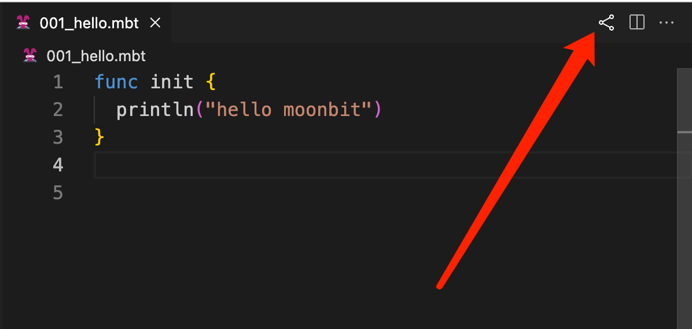

# 贡献指南

_我们鼓励包括问题报告、拉取 PR，以及任何形式的贡献！_

## :bulb: 提问

请访问我们的论坛 ([英文](https://discuss.moonbitlang.com/)/[中文](https://taolun.moonbitlang.com/))。
简而言之，GitHub 问题不是调试特定项目的地方，而是用于提交错误和功能请求。

## :inbox_tray: 提交问题

在提起 issue 之前，请先检查你使用的是否是 [最新版本](https://www.moonbitlang.com/download/) 的 MoonBit 工具链。如果不是，请先更新 MoonBit 工具链到最新版本并确定问题是否仍然存在。

向项目贡献的一个很好的方式是在遇到问题时提交详细的 issue。我们始终感谢编写完善、详尽的错误报告。:v:

简而言之，作为一名开发者，**请提供一个你自己也愿意收到的 issue** ：

- 如果你使用的是 [playground](https://try.moonbitlang.com/)，只需点击分享图标分享代码：

- 如果你使用的是 [moon build](https://www.moonbitlang.com/docs/build-system-tutorial/)，请提供 `moon version` 和你的操作系统版本的输出。

## :hammer: 贡献代码

我们鼓励贡献者使用 [GitHub 的 Pull Request (PR)](https://docs.github.com/en/pull-requests/collaborating-with-pull-requests/proposing-changes-to-your-work-with-pull-requests/about-pull-requests) 来提交他们的贡献，包括但不限于以下的贡献：
- 修正代码/文档中的错误
- 提交缺失的中文翻译或改进翻译

文档分为两部分，一部分为交互式的教程，一部分为静态的详细语言文档。

- 对于交互式教程：可以在[这里](https://github.com/moonbitlang/moonbit-docs/tree/main/moonbit-tour/tour)找到其源码，而中文内容则在[这里](https://github.com/moonbitlang/moonbit-docs/tree/main/moonbit-tour/tour/zh)可以找到。

- 对于静态的详细语言文档：可以在[这里](https://github.com/moonbitlang/moonbit-docs/tree/main/next)找到其源码，而中文内容则在[这里](https://github.com/moonbitlang/moonbit-docs/tree/main/next/locales/zh_CN/LC_MESSAGES)可以找到，需要额外注意到的是，中文内容是使用 gettext 工具生成的，因此需要额外注意其中的翻译文件的格式。

## :scroll: 翻译指南

这里是对于中文文档翻译的一些预期要求：

- 翻译需要尽可能忠于原文，不要出现过于冗余的翻译。

- 为保证美观和可读性，中文与英文相邻时要有空格分隔。

- 非特殊情况下请使用中文标点符号，包括但不限于冒号、逗号、句号、引号、全角括号等。

