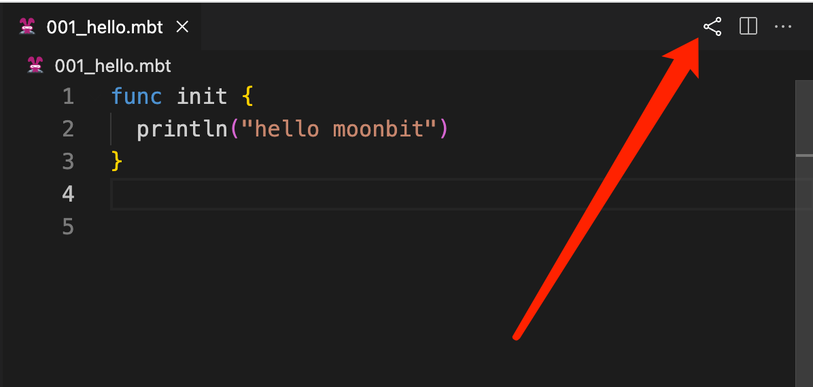

# Contributing Guidelines

_Pull requests, bug reports, and all other forms of contribution are welcomed and highly encouraged!_

## :bulb: Asking Questions

See our forum([EN](https://discuss.moonbitlang.com/)/[ZH](https://taolun.moonbitlang.com/)). In short, GitHub issues are not the appropriate place to debug your specific project, but should be reserved for filing bugs and feature requests.

## :inbox_tray: Opening an Issue

Before creating an issue, check if you are using the [latest version](https://www.moonbitlang.com/download/) of MoonBit. If you are not up-to-date, see if updating fixes your issue first.

A great way to contribute to the project is to send a detailed issue when you encounter a problem. We always appreciate a well-written, thorough bug report. :v:

In short, since you are most likely a developer, **provide a ticket that you would like to receive** :

- If you are using [playground](https://try.moonbitlang.com/), simply share the code that could reproduce the bug by clicking the share icon:

- If you are using [moon build](https://www.moonbitlang.com/docs/build-system-tutorial/), please provide the output of `moon version` and your OS version.
