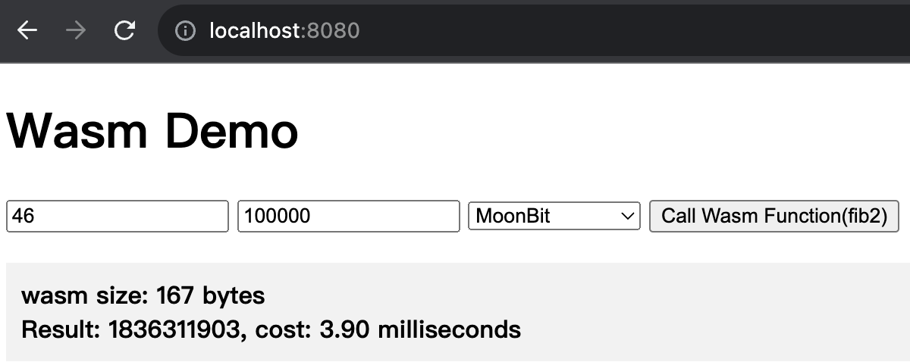
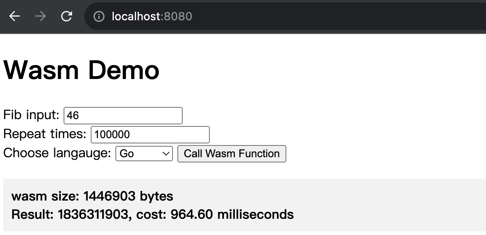
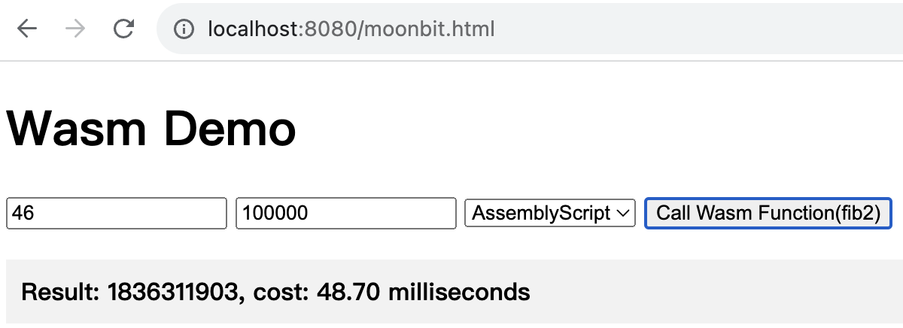

## Fibonacci

This folder will use various programming languages to build Wasm, which will calculate the nth Fibonacci number for the benchmark.

### Moonbit

Use Moonbit's [playground](https://try.moonbitlang.com/) or [build tool](https://www.moonbitlang.com/download/) to convert the following function to Wat:

```
pub func fib2(num : Int) -> Int {
  fn aux(n, acc1, acc2) {
    match n {
      0 => acc1
      1 => acc2
      _ => aux(n - 1, acc2, acc1 + acc2)
    }
  }

  aux(num, 0, 1)
}
```

Then use [wat2wasm](https://github.com/WebAssembly/wabt) from the WebAssembly Binary Toolkit (WABT) to convert the WebAssembly text format (.wat) to the WebAssembly binary format (.wasm):

```
wat2wasm target/build/main/main.wat -o moonbit.wasm
```

Or you can just use the `moonbit.wasm` in current folder.

Start a web server with `python3 -m http.server 8080`, and we can now test the benchmark of Moonbit by browsing http://127.0.0.1:8080/



### Golang

**CAUTION: Do not use the `wasm_exec.js` in the current folder.**, copy your own from `GOROOT`:

```
cp "$(go env GOROOT)/misc/wasm/wasm_exec.js" $PWD
```

Build `golang.wasm`

```
GOOS=js GOARCH=wasm go build -o golang.wasm ./main.go
```

Start a web server with `python3 -m http.server 8080`, and we can now test the benchmark of GO by browsing http://127.0.0.1:8080/



### AssemblyScript

Install AssemblyScript by:

```
npm i assemblyscript
```

Build `assemblyscript.wasm` by:

```
asc assemblyscript.ts --outFile assemblyscript.wasm --optimize
```

Start a web server with python3 -m http.server 8080, and we can now test the benchmark of AssemblyScript by browsing http://127.0.0.1:8080/



### Rust

```
rustup target add wasm32-unknown-unknown
cd fib-rust
cargo build --target wasm32-unknown-unknown --release
mv target/wasm32-unknown-unknown/release/fib-rust.wasm ../rust.wasm
```