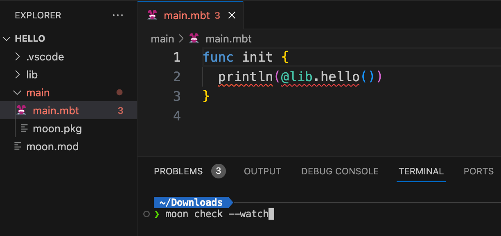
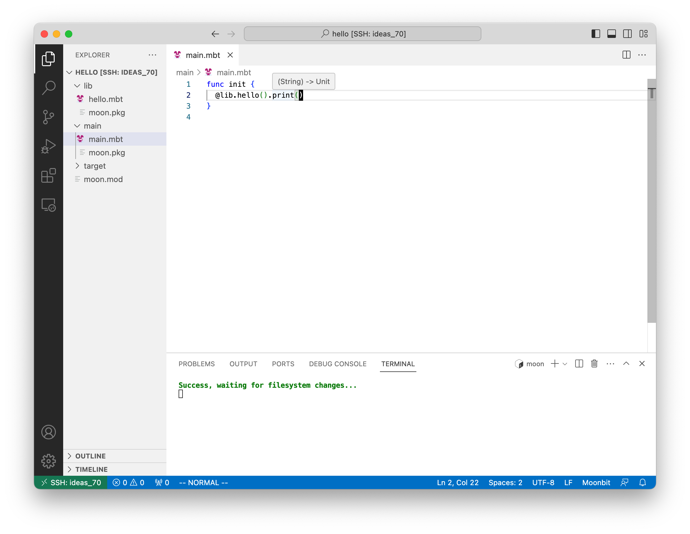

# MoonBit's Build System Tutorial

## Prerequisites

Before you begin with this tutorial, make sure you have installed the following:

1. **MoonBit CLI Tools**: Download it from the [https://www.moonbitlang.com/download/](https://www.moonbitlang.com/download/). This command line tool is needed for creating and managing MoonBit projects.

   Use `moon help` to view the usage instructions.

   ```bash
   $ moon help
   Moonbit's build system

   Usage: moon <COMMAND>

   Commands:
     build    Build the current package
     check    Check the current package, but don't build object files
     run      Run WebAssembly module
     clean    Remove the target directory
     new      Create a new moonbit package
     bench    Generate build matrix for benchmarking
     fmt      Format moonbit
     version  Print version info and exit
     test     Run the tests
     help     Print this message or the help of the given subcommand(s)

   Options:
     -h, --help  Print help
   ```

2. **Moonbit Language** plugin in Visual Studio Code: You can install it from the VS Code marketplace. This plugin provides a rich development environment for MoonBit, including functionalities like syntax highlighting, code completion, and more.

Once you have these prerequisites fulfilled, let's start building a new module in MoonBit.

## Creating a New Module

To create a new module, use the `moon new` command in your terminal:

```bash
moon new
```

This command will launch a new module wizard. Following all default options will a new module named `hello` in the `my-project` directory.

## Understanding the Module Directory Structure

After creating the new module, your directory structure should resemble the following:

```bash
my-project
├── lib
│   ├── hello.mbt
│   └── moon.pkg.json
├── main
│   ├── main.mbt
│   └── moon.pkg.json
└── moon.mod.json
```

Here's a brief explanation of the directory structure:

- `lib` and `main` directories: These are packages in the module. Each package can contain multiple `.mbt` files, which are the source code files in MoonBit language. However, regardless of the number of `.mbt` files in a package, they all share a common `moon.pkg.json` file.

- `moon.pkg.json` is package descriptor. It defines the properties of the package, such as whether it is the main package and the packages it imports.

  - `main/moon.pkg.json`:

  ```json
  {
    "is_main": true,
    "import": {
      "hello8/lib": ""
    }
  }
  ```

  Here, "is_main: true" declares that the package needs to be linked by the build system into a wasm file.

  - `lib/moon.pkg.json`:

  ```json
  {}
  ```

  This file is empty. Its purpose is simply to inform the build system that this folder is a package.

- `moon.mod.json` is used to identify a directory as a MoonBit module. It contains the module's name:

  ```json
  {
    "name": "hello"
  }
  ```

## Checking Your Project

You can open your project with Visual Studio Code. After you've installed the MoonBit plugin, you can use the `moon check --watch` command in your terminal to automatically check your project.



After executing `moon check --watch`, VS Code should look like this.



## Working with Packages

Our `hello` module contains two packages: `lib` and `main`.

The `lib` package contains a `hello.mbt` file:

```rust
pub fn hello() -> String {
    "Hello, world!\n"
}
```

The `main` package contains a `main.mbt` file:

```rust
fn init {
  println(@lib.hello())
}
```

To execute your program, specify the path to the `main` package:

```bash
$ moon run ./main
Hello, world!
```

## Package Importing

In the MoonBit's build system, a module's name is used to reference its internal packages.
To import the `lib` package in `main/main.mbt`, you need to specify it in `main/moon.pkg.json`:

```json
{
  "is_main": true,
  "import": {
    "hello/lib": ""
  }
}
```

Here, `"hello/lib": ""` specifies that the `lib` package from the `hello` module is to be imported, and `""` means that `lib` has no name alias.

## Creating and Using a New Package

First, create a new directory named `fib` under `lib`:

```bash
mkdir lib/fib
```

Now, you can create new files under `lib/fib`:

`a.mbt`:

```rust
pub fn fib(n : Int) -> Int {
  match n {
    0 => 0
    1 => 1
    _ => fib(n - 1) + fib(n - 2)
  }
}
```

`b.mbt`:

```rust
pub fn fib2(num : Int) -> Int {
  fn aux(n, acc1, acc2) {
    match n {
      0 => acc1
      1 => acc2
      _ => aux(n - 1, acc2, acc1 + acc2)
    }
  }

  aux(num, 0, 1)
}
```

`moon.pkg.json`:

```json
{}
```

After creating these files, your directory structure should look like this:

```bash
.
├── lib
│   ├── fib
│   │   ├── a.mbt
│   │   ├── b.mbt
│   │   └── moon.pkg.json
│   ├── hello.mbt
│   └── moon.pkg.json
├── main
│   ├── main.mbt
│   └── moon.pkg.json
└── moon.mod.json
```

In the `main/moon.pkg.json` file, import package `hello/lib/fib`:

```json
{
  "is_main": true,
  "import": {
    "hello/lib": "",
    "hello/lib/fib": ""
  }
}
```

This line imports the `fib` package, which is part of the `lib` package in the `hello` module. After doing this, you can use the `fib` package in `main/main.mbt`. Replace the file content of `main/main.mbt` to:

```rust
fn init {
  let a = @fib.fib(10)
  let b = @fib.fib2(11)
  println("fib(10) = \(a), fib(11) = \(b)")
}
```

To execute your program, specify the path to the `main` package:

```bash
$ moon run ./main
fib(10) = 55, fib(11) = 89
```

## Inline tests

In the last, let's add some tests to verify our fib implementation. Add the following to `lib/fib/a.mbt`:

```rust
fn assert_eq[T: Show + Eq](lhs: T, rhs: T) {
  if lhs != rhs {
    abort("assert_eq failed.\n    lhs: \(lhs)\n    rhs: \(rhs)")
  }
}

test {
  assert_eq(fib(1), 1)
  assert_eq(fib(2), 1)
  assert_eq(fib(3), 2)
  assert_eq(fib(4), 3)
  assert_eq(fib(5), 5)
}
```

This code tests the first five terms of the Fibonacci sequence. `test { ... }` defines an inline test block. The code inside inline test blocks will be executed in test mode, using `moon test`:

```bash
$ moon test
test lib/fib ... ok
```

`moon test` will execute all inline tests in current module.

Inline test blocks will be discarded in normal mode (`moon build` and `moon run`), so they will not result in code size bloat.

## Stand-alone test files

Besides inline tests, MoonBit also supports stand-alone test files. Source files whose names end with `_test.mbt` will be considered test files. They will be included in test mode only. You can write inline tests and test utilities in these stand-alone test files.
For example, inside the `lib/fib` directory, create a file named `fib_test.mbt` and paste the following code:

```rust
fn assert_eq[T: Show + Eq](lhs: T, rhs: T) {
  if lhs != rhs {
    abort("assert_eq failed.\n    lhs: \(lhs)\n    rhs: \(rhs)")
  }
}

test  {
  assert_eq(fib(1), 1)
  assert_eq(fib(2), 1)
  assert_eq(fib(3), 2)
  assert_eq(fib(4), 3)
  assert_eq(fib(5), 5)
}
```

`moon test` will include all scanfiles ending with `_test.mbt` during compilation. If everything works, run `moon test`, and you'll see:

```bash
$ moon test
test lib/fib ... ok
```
