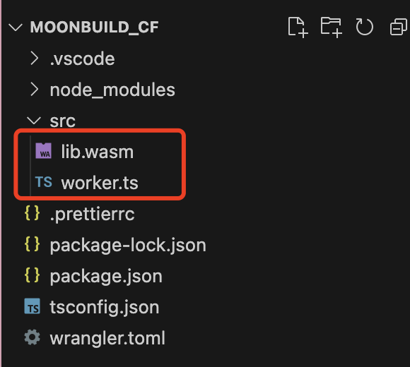

## Moonbit's Cloudflare Worker Demo

This project showcases how to generate a compact WebAssembly (Wasm) by Moonbit, and invoke it from JavaScript in a Cloudflare worker environment. It is an implementation of the [Invoke Wasm from JavaScript](https://developers.cloudflare.com/workers/runtime-apis/webassembly/javascript/) guide.

## Setup Wrangler

Before you begin, make sure you have the [wrangler](https://developers.cloudflare.com/workers/wrangler/install-and-update/) CLI installed. Wrangler is used to create, build, and publish Cloudflare workers.

To set up a new project, just run `wrangler init`` and answer the prompts:
- Project Name: Enter a name for your project, such as "moonbit_cf".
- Application Type: Select "Hello World" script.
- Use TypeScript: Select 'y' for yes.
- Deploy Your Application: Select 'n' for no.

## Building Moonbit

Clone this repository and run moon build to compile the project. This command generates a main.wat file in the target/build/main/ directory.

We'll use [wat2wasm](https://github.com/WebAssembly/wabt) from the WebAssembly Binary Toolkit (WABT) to convert the WebAssembly text format (.wat) to the WebAssembly binary format (.wasm):

```
wat2wasm target/build/main/main.wat -o lib.wasm
```

Place the resulting `lib.wasm` file in the `src` directory of your Cloudflare worker:



## Run the Worker

Navigate to your Cloudflare worker's directory (e.g., `moonbit_cf`) and use Wrangler to start the development server.

You should see output indicating the server is running, like this:

```shell
$ wrangler dev
 ⛅️ wrangler 3.5.0
------------------
wrangler dev now uses local mode by default, powered by 🔥 Miniflare and 👷 workerd.
To run an edge preview session for your Worker, use wrangler dev --remote
⎔ Starting local server...
[mf:wrn] The latest compatibility date supported by the installed Cloudflare Workers Runtime is "2023-08-07",
but you've requested "2023-08-09". Falling back to "2023-08-07"...
[mf:inf] Ready on http://127.0.0.1:8787/
[mf:inf] GET / 200 OK (2ms)
[mf:inf] GET /favicon.ico 200 OK (0ms)
⎔ Reloading local server...
[mf:inf] Updated and ready on http://127.0.0.1:8787/
```

You can now navigate to http://127.0.0.1:8787/ in your web browser to see the worker in action.


