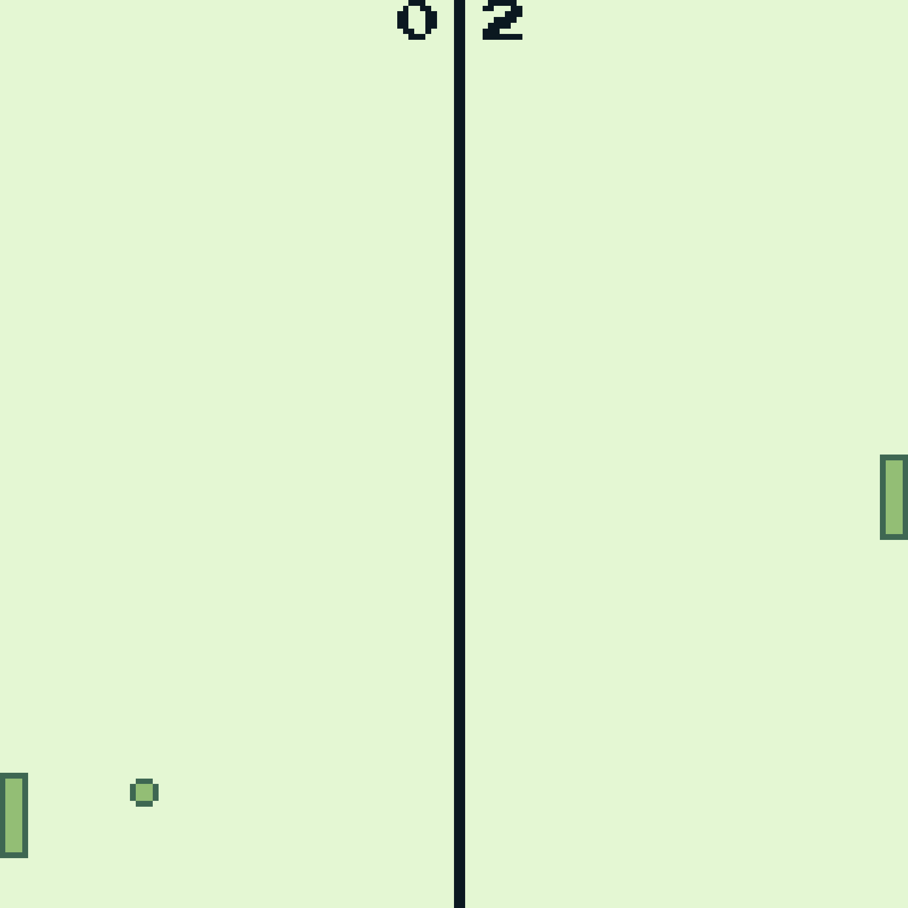

# Retro Gaming with WASM-4 in MoonBit

WASM-4 is a low-level fantasy game console for building small, retro games with WebAssembly.
Unlike many languages that can/may compile to WebAssembly, MoonBit provides
**first-party** support for wasm target, community support for wasm-4 binding,
making it a neat language for WASM-4 game building.

We'll demonstrate the usage with a very simple ping pong game that surprisingly has
**multiplayer** support.



## Prerequisite

- wasm-4 runtime, can be installed with

```bash
npm install -D wasm4
```

- A new MoonBit project, of course.
  Add wasm4 binding for moonbit as a dependency: `moon add moonbitlang/wasm4`.

- modify `moon.pkg.json` with linking config that export a `start` and a `update`:

```json
{
  "import": ["moonbitlang/wasm4"],
  "link": {
    "wasm-gc": {
      "exports": ["start", "update"],
      "import-memory": {
        "module": "env",
        "name": "memory"
      }
    },
    "wasm": {
      "exports": ["start", "update"],
      "import-memory": {
        "module": "env",
        "name": "memory"
      },
      "heap-start-address": 6590
    }
  }
}
```

Note that for wasm backend, address `0x0000 ~ 0x19BE` (`6590`, exclusive) is
allocated for wasm4 ABI, MoonBit's heap starts from that very address. This may
be omitted for wasm-gc.

- `start` `update` must be exported per requirements of wasm-4 ABI.
  - `start` is executed only once on initialization.
  - `update` is executed at the game's refresh rate, 60Hz.

Basic thoughts is that we put anything _static_ i.e. that does not change
throughout the game in `start` (e.g. initializing color palette), anything else is either auxiliary function or
dynamic code i.e. code that updates the game state. These code goes into `update` and the main
logic/function calls will always be done in `update`.

In MoonBit, a function is _exported_ through making it `pub`-lic.

With everything set correctly, we may start building the game.

## Drawing the ball

Since we are making a ping pong game, first things first, let's draw a ball and 2 bats.

```moonbit
@wasm4.set_draw_colors(0x2U, index=1)
@wasm4.set_draw_colors(0x3U, index=2)
@wasm4.oval(bs.ball_x, bs.ball_y, ball_size, ball_size)
@wasm4.rect(0, bs.y_2, width, height)
@wasm4.rect(screen_size - width, bs.y_1, width, height)
```

`oval` draws an oval at given position `(ball_x,ball_y)`. An oval with the same height and width is essentially a circle, with it's diameter being `ball_size`.

### Making it colorful

According to the [memory layout](https://wasm4.org/docs/reference/memory),
wasm-4's palette register (called `PALETTE`, invisible to user in MoonBit's
wasm-4 binding) can only store 4 colors at a time, but the palette may be
modified on-the-fly to introduce new colors. `set_palette` is used to configure
the palette, but we'll stick to the default one in this example.

The default gameboy-like color palette looks like

<div className="row row--no-gutters">
    <div className="col col--2" style={{padding: "1.5rem", background: "#e0f8cf", color: "#000"}}>Color 1</div>
    <div className="col col--2" style={{padding: "1.5rem", background: "#86c06c", color: "#000"}}>Color 2</div>
    <div className="col col--2" style={{padding: "1.5rem", background: "#306850", color: "#fff"}}>Color 3</div>
    <div className="col col--2" style={{padding: "1.5rem", background: "#071821", color: "#fff"}}>Color 4</div>
</div>

However builtin drawing functions do not use palette to access the color,
rather, the `DRAW_COLORS` register which also holds 4 color is used (invisible
to user as well).

```moonbit
// retrieve the color based on `palette_index` from PALETTE
// and set `DRAW_COLORS` with given `index`
set_draw_colors(palette_index, index)
```

The key difference between `DRAW_COLORS` and `PALETTE` is that the colors in
`DRAW_COLORS` has different uses:

For builtin shapes such as `oval` `rectangle`, the first color is the fill, the
second one being the outline.

Thus our ping pong ball should look like:

<div style={{ position: 'relative', height: '80px', width: '120px' }}>
  <div style={{
  boxShadow: `10px 10px 0 0 rgba(224,248,207,1), 
              20px 10px 0 0 rgba(48,104,80,1), 
              30px 10px 0 0 rgba(48,104,80,1), 
              40px 10px 0 0 rgba(48,104,80,1), 
              50px 10px 0 0 rgba(224,248,207,1), 
              10px 20px 0 0 rgba(48,104,80,1), 
              20px 20px 0 0 rgba(134,192,108,1), 
              30px 20px 0 0 rgba(134,192,108,1), 
              40px 20px 0 0 rgba(134,192,108,1), 
              50px 20px 0 0 rgba(48,104,80,1), 
              10px 30px 0 0 rgba(48,104,80,1), 
              20px 30px 0 0 rgba(134,192,108,1), 
              30px 30px 0 0 rgba(134,192,108,1), 
              40px 30px 0 0 rgba(134,192,108,1), 
              50px 30px 0 0 rgba(48,104,80,1), 
              10px 40px 0 0 rgba(48,104,80,1), 
              20px 40px 0 0 rgba(134,192,108,1), 
              30px 40px 0 0 rgba(134,192,108,1), 
              40px 40px 0 0 rgba(134,192,108,1), 
              50px 40px 0 0 rgba(48,104,80,1), 
              10px 50px 0 0 rgba(224,248,207,1), 
              20px 50px 0 0 rgba(48,104,80,1), 
              30px 50px 0 0 rgba(48,104,80,1), 
              40px 50px 0 0 rgba(48,104,80,1), 
              50px 50px 0 0 rgba(224,248,207,1)`,
  height: '10px',
  width: '10px',
  }}>
  </div>
</div>

Remember that any dynamic drawing code (like the ones above) must be
placed/called inside `update`. The only way for the game to update its state is
through the `update` function.

## Dealing with collision

In Wasm-4, origin `(0,0)` is at top left corner. y-axis is upside down.

Collision or not can be divide into 3 cases:

- ball does not collide with the bats at the moment, denote as `0`
- ball collides with the left one, results in ball bouncing towards right, denote as `1`
- ball collides with the right one, results in ball bouncing towards left, denote as `-1`

We denote the position of the left,right bats as `y_1` `y_2` (bats can only move up or down). The return
value of the collision handling function must return the direction that the ball
is currently going towards, `0/1/-1`.

Laying out these conditions, we may implement `paddle_collision` as:

```moonbit
pub fn paddle_collision(
  y_1 : Int,
  y_2 : Int,
  ball_x : Int,
  ball_y : Int
) -> Int {
  if ball_x < width && ball_y < y_2 + height && ball_y + ball_size > y_2 {
    1
  } else if ball_x + ball_size > screen_size - width &&
    ball_y < y_1 + height &&
    ball_y + ball_size > y_1 {
    -1
  } else {
    0
  }
}
```

## Moving the bat

To move the bat, we just need to update `y_1` `y_2`. In wasm-4, user input is
captured via accessing gamepads. An gamepad consists of 4 direction keys and 2
action buttons. There are four game pads in total (i.e. up to 4 players), by default
`gamepad1` is used first.

In MoonBit, gamepad is accessed with

```moonbit
get_gamepad().<BUTTON> : Bool
```

Key down results in a `true`, otherwise `false`.

### Networking

This is the part where we introduce netplay, the multiplayer feature in wasm-4.
It turns out we never need to deal with network stacks. WebRTC is used under the
hood but that's none of our concern. To us, players are represented by their
gamepads. So if a player joins, they will use one of the rest controllers in a
numeric order. e.g. if `gamepad1` is used by another player, `gamepad2` becomes
available to the next player that joins the game.

Ping pong is a 2-player game. We bind `gamepad1` to the right bat; `gamepad2` to the left bat.

By default, the position of the left bat is set to track the ball's, which act
as an AI that never fails to hit the ball. But we may use the builtin

```moonbit
get_netplay() : Bool
```

to tell if multiplayer features is active: If it is, then activate `gamepad2`
for player2 to use, otherwise let AI play.

```moonbit
// guard rules: if the position exceeds the screen height.
  if @wasm4.get_gamepad().button_up && bs.y_1 > 0 {
    bs.y_1 -= 2
  } else if @wasm4.get_gamepad().button_down && bs.y_1 + height < screen_size {
    bs.y_1 += 2
  }
  if @wasm4.get_netplay().active {
    if @wasm4.get_gamepad(index=2).button_up && bs.y_2 > 0 {
      bs.y_2 -= 2
    } else if @wasm4.get_gamepad(index=2).button_down &&
      bs.y_2 + height < screen_size {
      bs.y_2 += 2
    }
  } else {
    bs.y_2 = bs.ball_y
  }
```

- `bs` is short for `BallStat`. A structure we defined to track current state of the game:

```moonbit
struct BallStats {
  mut ball_x : Int // ball's horizontal pos
  mut ball_y : Int // ball's vertical pos
  mut dir_x : Int // ball's direction (horizontal)
  mut dir_y : Int // ball's direction (vertical)
  mut y_1 : Int // left bat position
  mut y_2 : Int // right bat position
  mut score_1 : Int // player1
  mut score_2 : Int // player2
}
```

## Sound Feedback

Wasm-4 certainly does not lack the nostalgic of 8-bit sound effects. By sound we mean tone.
To play a tone, we would use the builtin

```moonbit
fn tone(
  frequency : (UInt, UInt),
  duration : ADSR,
  volume : ADSRVolume,
  flags : ToneFlag
)
```

- frequency: is the "pitch" of the sound that is measured in Hz.
- Duration is in [envelope](<https://en.wikipedia.org/wiki/Envelope_(music)>). An
  envelope describes how a sound changes over time, the ADSR here specifies the
  four parameters _attack_, _decay_, _sustain_ and _release_.
- volume: literally, the volume of the tone.
- flags: channel, duty cycle and panning. For ping pong we do not to explicitly
  set this.

To sound a tone whenever the ball collides with the bat, for example, we'll need
to get the collision info, and as we've talked about, `paddle_collision` returns
non-zero value if ball collides:

```moonbit
  let dir_now = paddle_collision(bs.y_1, bs.y_2, bs.ball_x, bs.ball_y)
  if dir_now != 0 { // ball collides
    let int_rng = rng.int() % 2
    bs.dir_x = dir_now
    @wasm4.tone(
      (2000, 0),
      @wasm4.ADSR::new(5),
      @wasm4.ADSRVolume::new(100),
      @wasm4.ToneFlag::new(),
    )
    bs.dir_y = dir_now * if int_rng != 0 { -1 } else { 1 }
  }
```

Or if the ball hit the bottom/top of the screen, the ball gets bounced back and emits a tone feedback:

```moonbit
  if bs.ball_y > screen_size || bs.ball_y < 0 {
    @wasm4.tone(
      (2000, 0),
      @wasm4.ADSR::new(5),
      @wasm4.ADSRVolume::new(100),
      @wasm4.ToneFlag::new(),
    )
    bs.dir_y = -bs.dir_y
  }
```

As we've specified before, `dir_now` shall be a non-zero if collision is
detected: We sound a tone then.

## Whole code

The whole code is merely 120-ish (counts pretty formatted code, otherwise much less) lines, very simple.

```moonbit
let width = 5

let height = 15

let ball_size = 5

let screen_size = 160

pub fn paddle_collision(
  y_1 : Int,
  y_2 : Int,
  ball_x : Int,
  ball_y : Int
) -> Int {
  if ball_x < width && ball_y < y_2 + height && ball_y + ball_size > y_2 {
    1
  } else if ball_x + ball_size > screen_size - width &&
    ball_y < y_1 + height &&
    ball_y + ball_size > y_1 {
    -1
  } else {
    0
  }
}

pub fn start() -> Unit {
  @wasm4.set_draw_colors(0x4U, index=1)
  @wasm4.set_draw_colors(0x1U, index=2)
}

struct BallStats {
  mut ball_x : Int // ball's horizontal pos
  mut ball_y : Int // ball's vertical pos
  mut dir_x : Int // ball's direction (horizontal)
  mut dir_y : Int // ball's direction (vertical)
  mut y_1 : Int // left bat position
  mut y_2 : Int // right bat position
  mut score_1 : Int // player1
  mut score_2 : Int // player2
}

pub fn BallStats::new() -> BallStats {
  {
    ball_x: screen_size / 2,
    ball_y: screen_size / 2,
    dir_x: 1,
    dir_y: 1,
    y_1: screen_size / 2,
    y_2: screen_size / 2,
    score_1: 0,
    score_2: 0,
  }
}

let bs : BallStats = BallStats::new()

let rng : @random.Rand = @random.new()

pub fn update() -> Unit {
  if @wasm4.get_gamepad().button_up && bs.y_1 > 0 {
    bs.y_1 -= 2
  } else if @wasm4.get_gamepad().button_down && bs.y_1 + height < screen_size {
    bs.y_1 += 2
  }
  if @wasm4.get_netplay().active {
    if @wasm4.get_gamepad(index=2).button_up && bs.y_2 > 0 {
      bs.y_2 -= 2
    } else if @wasm4.get_gamepad(index=2).button_down &&
      bs.y_2 + height < screen_size {
      bs.y_2 += 2
    }
  } else {
    bs.y_2 = bs.ball_y
  }
  let dir_now = paddle_collision(bs.y_1, bs.y_2, bs.ball_x, bs.ball_y)
  if dir_now != 0 { // ball collides
    let int_rng = rng.int() % 2
    bs.dir_x = dir_now
    @wasm4.tone(
      (2000, 0),
      @wasm4.ADSR::new(5),
      @wasm4.ADSRVolume::new(100),
      @wasm4.ToneFlag::new(),
    )
    bs.dir_y = dir_now * if int_rng != 0 { -1 } else { 1 }
  }
  bs.ball_x += bs.dir_x
  bs.ball_y += bs.dir_y
  // ball exceeds screen vertically, should bounce back
  if bs.ball_y > screen_size || bs.ball_y < 0 {
    @wasm4.tone(
      (2000, 0),
      @wasm4.ADSR::new(5),
      @wasm4.ADSRVolume::new(100),
      @wasm4.ToneFlag::new(),
    )
    bs.dir_y = -bs.dir_y
  }
  // ball exceeds the screen horizontally i.e. player failed to hit it
  if bs.ball_x <= 0 || bs.ball_x > screen_size {
    if bs.ball_x <= 0 { // left failed
      bs.score_2 += 1
    } else if bs.ball_x > screen_size {
      bs.score_1 += 1 // right failed
    }
    bs.ball_x = screen_size / 2
    bs.ball_y = screen_size / 2
    @wasm4.tone(
      (1000, 0),
      @wasm4.ADSR::new(5),
      @wasm4.ADSRVolume::new(100),
      @wasm4.ToneFlag::new(),
    )
    bs.dir_x = -bs.dir_x
  }
  @wasm4.set_draw_colors(0x4U, index=1)
  @wasm4.set_draw_colors(0x0U, index=2)
  @wasm4.text(bs.score_2.to_string(), 70, 0)
  @wasm4.text(bs.score_1.to_string(), 85, 0)
  @wasm4.rect(screen_size / 2, 0, 2, screen_size)
  @wasm4.set_draw_colors(0x2U, index=1)
  @wasm4.set_draw_colors(0x3U, index=2)
  @wasm4.oval(bs.ball_x, bs.ball_y, ball_size, ball_size)
  @wasm4.rect(0, bs.y_2, width, height)
  @wasm4.rect(screen_size - width, bs.y_1, width, height)
}
```

## Build & Enjoy

Building:

```bash
moon build --target {wasm-gc, wasm}
```

Running w/ wasm4 and npx:

```bash
npx wasm4 run target/{wasm-gc,wasm}/release/build/{PACKAGE_PATH}/{PACKAGE_NAME}.wasm
```

The game will open itself in the browser.
