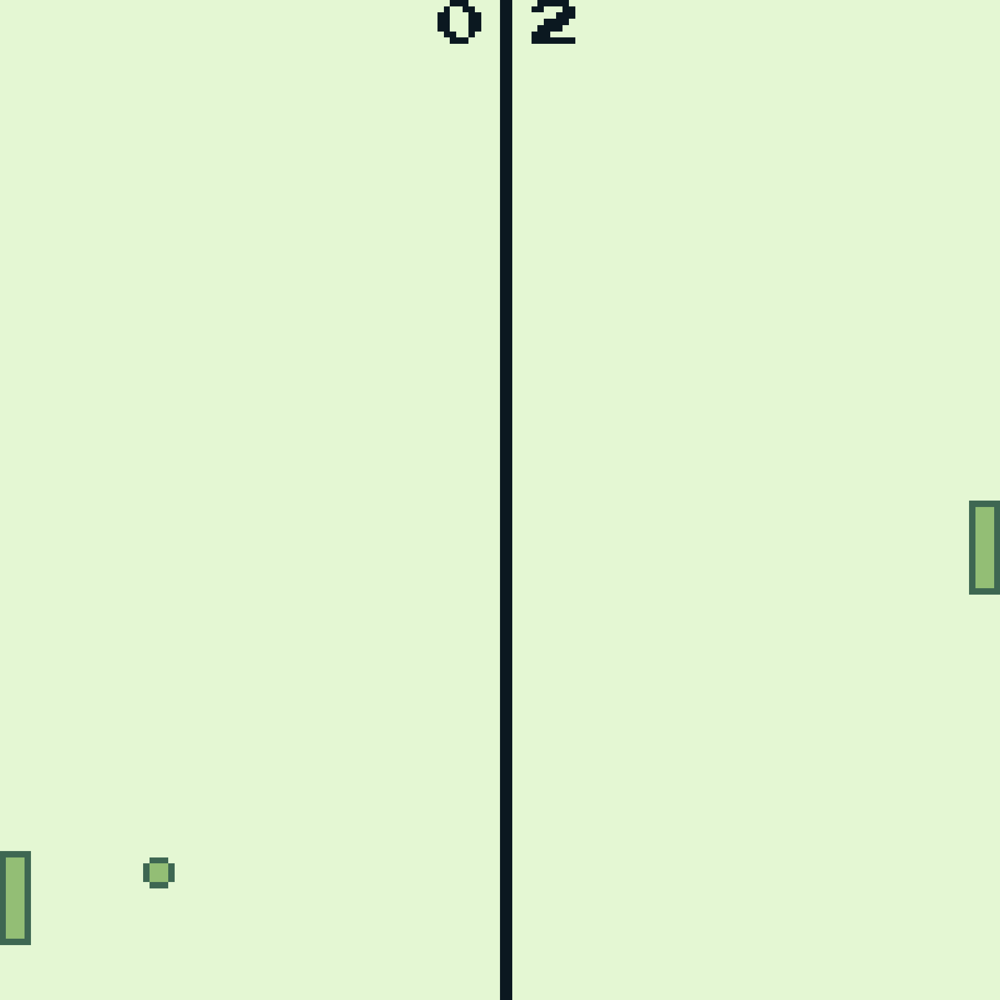

# Wasm4 案例：双人乒乓球

WASM-4 是一款使用 WebAssembly 实现的较底层的虚拟游戏机，主要用于构建小型、复古的游戏。 和其他一些可能可以编译到 WebAssembly 的语言不同，MoonBit 为 WASM 平台提供**第一方支持**，社区则提供了 WASM-4 的 binding。 使用 WASM-4 进行游戏开发，MoonBit 是有许多优势的。

我们用一个十分简单的，但却支持**多人游玩**的乒乓游戏来展示如何利用 WASM-4 开发小型游戏。



## 配置环境

- wasm-4 runtime，可通过 npm 安装：

```bash
npm install -D wasm4
```

- 新建一个 MoonBit 项目，将 wasm4 binding 作为依赖加入到项目中： `moon add moonbitlang/wasm4`.

- 修改 `moon.pkg.json` ，linking 配置中应当导出 `start` `update` 方法供 wasm-4 调用：:

```json
{
  "import": ["moonbitlang/wasm4"],
  "link": {
    "wasm-gc": {
      "exports": ["start", "update"],
      "import-memory": {
        "module": "env",
        "name": "memory"
      }
    },
    "wasm": {
      "exports": ["start", "update"],
      "import-memory": {
        "module": "env",
        "name": "memory"
      },
      "heap-start-address": 6590
    }
  }
}
```

注意对于 wasm 后端，在 `0x0000 ~ 0x19BE`（`6590`，开区间）范围内的地址是分配给 wasm4 ABI 的，MoonBit 的堆在该区间之后。 若使用 wasm-gc 后端则不需配置。

- 根据 ABI 的规格，必须要导出 `start` `update` 方法
  - `start` 仅在游戏初始化时执行一次
  - `update` 会以游戏刷新率（60Hz）的频率执行

基本想法是，我们将任何静态代码（即那些不会改变游戏状态的代码）放在 `start` 中（例如初始化调色板）； 除此之外的动态代码（即那些会更改游戏状态的），就需要放在 `update` 中。 游戏的主要逻辑和相关的函数调用都是在 `update` 中完成的。

在 MoonBit 中，函数是通过改变其可见性为 `pub` 来实现导出功能的。

确保环境配置一切无误之后，我们就可以开始编写游戏了。

## 画一个乒乓球

毕竟我们是实现一个乒乓游戏，那么最基本的工作就是绘制球和挡板：

```moonbit
@wasm4.set_draw_colors(0x2U, index=1)
@wasm4.set_draw_colors(0x3U, index=2)
@wasm4.oval(bs.ball_x, bs.ball_y, ball_size, ball_size)
@wasm4.rect(0, bs.y_2, width, height)
@wasm4.rect(screen_size - width, bs.y_1, width, height)
```

`oval`  用于在给定中心 `(ball_x,ball_y)` 处绘制椭圆。长轴和短轴相等的椭圆就是一个圆，且它的直径是 `ball_size`。

### 为元素上色

根据 [memory layout](https://wasm4.org/docs/reference/memory)， wasm-4 的调色板寄存器（ `PALETTE`，在 MoonBit 的绑定中对用户不可见）一次只能存储 4 种颜色， 但可以通过随时更改这一寄存器来引入新的颜色。我们使用 `set_palette` 来配置调色板，但在这个实现中就使用默认颜色配置了。

默认的配色看起来像 gameboy 的：

<div className="row row--no-gutters">
    <div className="col col--2" style={{padding: "1.5rem", background: "#e0f8cf", color: "#000"}}>Color 1</div>
    <div className="col col--2" style={{padding: "1.5rem", background: "#86c06c", color: "#000"}}>Color 2</div>
    <div className="col col--2" style={{padding: "1.5rem", background: "#306850", color: "#fff"}}>Color 3</div>
    <div className="col col--2" style={{padding: "1.5rem", background: "#071821", color: "#fff"}}>Color 4</div>
</div>

但需要注意内置的绘图函数不直接访问这个寄存器， 而是访问同样能够存储 4 个颜色的 `DRAW_COLORS` 寄存器（也对用户不可见）。

```moonbit
// 按 `palette_index` 访问 PALETTE 的颜色
// 并将之设定为 `DRAW_COLORS` 对应 `index` 的颜色
set_draw_colors(palette_index, index)
```

这两个寄存器的关键区别在于 `DRAW_COLORS` 的 4 个颜色具有不同的用途：

对内置的 `oval` `rectangle`形状来说，寄存器的第一个颜色是填充色，第二个颜色是边框色。

因而我们的乒乓球看起来应该像：

<div style={{ position: 'relative', height: '80px', width: '120px' }}>
  <div style={{
  boxShadow: `10px 10px 0 0 rgba(224,248,207,1), 
              20px 10px 0 0 rgba(48,104,80,1), 
              30px 10px 0 0 rgba(48,104,80,1), 
              40px 10px 0 0 rgba(48,104,80,1), 
              50px 10px 0 0 rgba(224,248,207,1), 
              10px 20px 0 0 rgba(48,104,80,1), 
              20px 20px 0 0 rgba(134,192,108,1), 
              30px 20px 0 0 rgba(134,192,108,1), 
              40px 20px 0 0 rgba(134,192,108,1), 
              50px 20px 0 0 rgba(48,104,80,1), 
              10px 30px 0 0 rgba(48,104,80,1), 
              20px 30px 0 0 rgba(134,192,108,1), 
              30px 30px 0 0 rgba(134,192,108,1), 
              40px 30px 0 0 rgba(134,192,108,1), 
              50px 30px 0 0 rgba(48,104,80,1), 
              10px 40px 0 0 rgba(48,104,80,1), 
              20px 40px 0 0 rgba(134,192,108,1), 
              30px 40px 0 0 rgba(134,192,108,1), 
              40px 40px 0 0 rgba(134,192,108,1), 
              50px 40px 0 0 rgba(48,104,80,1), 
              10px 50px 0 0 rgba(224,248,207,1), 
              20px 50px 0 0 rgba(48,104,80,1), 
              30px 50px 0 0 rgba(48,104,80,1), 
              40px 50px 0 0 rgba(48,104,80,1), 
              50px 50px 0 0 rgba(224,248,207,1)`,
  height: '10px',
  width: '10px',
  }}>
  </div>
</div>

注意像这样动态的绘图代码必须在 `update`中调用。更新游戏状态的唯一方法就是通过 `update` 函数。

## 处理撞击情况

在 wasm-4 中，原点 `(0,0)` 在左上角，纵轴指向下。

乒乓球的撞击情况有三种：

- 球根本没有发生撞击，记为 `0`
- 球与左侧挡板撞击，弹向右侧，记为 `1`
- 球与右侧挡板撞击，弹向左侧，记为 `-1`

我们将左右侧挡板记为 `y_1` `y_2` （挡板只能上下移动）。用于处理撞击的函数必须返回球撞击后的方向（或0），即 `0/1/-1`.

列出这些情况后，我们可以实现 `paddle_collision` 如下：

```moonbit
pub fn paddle_collision(
  y_1 : Int,
  y_2 : Int,
  ball_x : Int,
  ball_y : Int
) -> Int {
  if ball_x < width && ball_y < y_2 + height && ball_y + ball_size > y_2 {
    1
  } else if ball_x + ball_size > screen_size - width &&
    ball_y < y_1 + height &&
    ball_y + ball_size > y_1 {
    -1
  } else {
    0
  }
}
```

## 移动挡板

移动挡板就是更新 `y_1` `y_2`。在 wasm-4 中，用户输入是通过 gamepads 获取的。一个 gamepad 包括 4 个方向键，两个动作键。总共有 4 个 gamepads（即最多 4 名玩家），默认情况下 `gamepad1` 最先使用。

MoonBit 中使用以下方法访问 gamepad：

```moonbit
get_gamepad().<BUTTON> : Bool
```

当按键按下时返回一个 `true`，否则 `false`.

### Networking

这里正好可以顺便介绍 netplay，wasm-4 的多人游戏功能。实际上我们根本不需要处理网络栈， wasm-4 底层使用 WebRTC 但这我们不需要在意。对开发者来说，玩家就是通过对应的 gamepads 来表示的。 因此若一个玩家加入，游戏会按 gamepads 的数字顺序分配给其一个 gamepad。 例如 `gamepad1` 已经被某名玩家使用， 在其之后若还有玩家加入则会为其分配 `gamepad2`。

乒乓是一个双人游戏，我们将 `gamepad1` 绑定到右侧挡板上；`gamepad2` 绑定到左侧挡板上。

默认情况下，左侧挡板的位置是根据乒乓球上下位置决定的，也就是说左侧挡板作为一个永远不会漏球的 AI 来和玩家竞争。 但我们也可以用内置的

```moonbit
get_netplay() : Bool
```

来确认多人游戏功能有没有启用：如果启用，则启用 `gamepad2`；否则让 AI 接手。

```moonbit
// 判定若挡板高度超过屏幕高度
  if @wasm4.get_gamepad().button_up && bs.y_1 > 0 {
    bs.y_1 -= 2
  } else if @wasm4.get_gamepad().button_down && bs.y_1 + height < screen_size {
    bs.y_1 += 2
  }
  if @wasm4.get_netplay().active {
    if @wasm4.get_gamepad(index=2).button_up && bs.y_2 > 0 {
      bs.y_2 -= 2
    } else if @wasm4.get_gamepad(index=2).button_down &&
      bs.y_2 + height < screen_size {
      bs.y_2 += 2
    }
  } else {
    bs.y_2 = bs.ball_y
  }
```

- `bs` 是 `BallStat` 的简写，是一个用于记录当前游戏状态的 struct。

```moonbit
struct BallStats {
  mut ball_x : Int // ball's horizontal pos
  mut ball_y : Int // ball's vertical pos
  mut dir_x : Int // ball's direction (horizontal)
  mut dir_y : Int // ball's direction (vertical)
  mut y_1 : Int // left bat position
  mut y_2 : Int // right bat position
  mut score_1 : Int // player1
  mut score_2 : Int // player2
}
```

## 音效反馈

wasm-4 当然是不缺那些怀旧的八位机游戏音效（tone）的。要播放一个 tone，我们一般使用内置的

```moonbit
fn tone(
  frequency : (UInt, UInt),
  duration : ADSR,
  volume : ADSRVolume,
  flags : ToneFlag
)
```

- frequency：频率，即用频率度量的音调
- Duration：时长，是用 [envelope](<https://en.wikipedia.org/wiki/Envelope_(music)>) 记录的。 envelope 用于记录一个声音随着时间的变化， 此处的 ADSR 指定了 envelope 的四个参数 _attack_, _decay_, _sustain_ and _release_。
- volume：字面义，音量大小
- flags：包括 channel, duty cycle 和 panning。 对于我们的乒乓游戏来说，使用默认值即可。

例子：在球发生撞击的时候播放音效，我们需要获取判定球是否发生撞击，即上边所说 `paddle_collision` 返回的值是否非零：

```moonbit
  let dir_now = paddle_collision(bs.y_1, bs.y_2, bs.ball_x, bs.ball_y)
  if dir_now != 0 { // ball collides
    let int_rng = rng.int() % 2
    bs.dir_x = dir_now
    @wasm4.tone(
      (2000, 0),
      @wasm4.ADSR::new(5),
      @wasm4.ADSRVolume::new(100),
      @wasm4.ToneFlag::new(),
    )
    bs.dir_y = dir_now * if int_rng != 0 { -1 } else { 1 }
  }
```

或者当球撞击到屏幕的顶部/底部时，球应该回弹并反馈音效：

```moonbit
  if bs.ball_y > screen_size || bs.ball_y < 0 {
    @wasm4.tone(
      (2000, 0),
      @wasm4.ADSR::new(5),
      @wasm4.ADSRVolume::new(100),
      @wasm4.ToneFlag::new(),
    )
    bs.dir_y = -bs.dir_y
  }
```

正如我们之前所规定的，如果检测到碰撞，`dir_now` 应为非零值：此时我们会发出提示音。

## 完整代码

[这里](https://github.com/notch1p/wasm4-examples/blob/08b6cc7728a909602a0027d9ef058ff0b33dd4a0/tinypong/src/main/main.mbt)的完整代码（120 行左右）也包括了格式化之后产生的各种换行，否则会更少。十分简单。

## 编译 & 游玩

构建:

```bash
moon build --target {wasm-gc, wasm}
```

通过 wasm4 和 npx 运行：

```bash
npx wasm4 run target/{wasm-gc,wasm}/release/build/{PACKAGE_PATH}/{PACKAGE_NAME}.wasm
```

游戏应该会自动在浏览器中打开。
