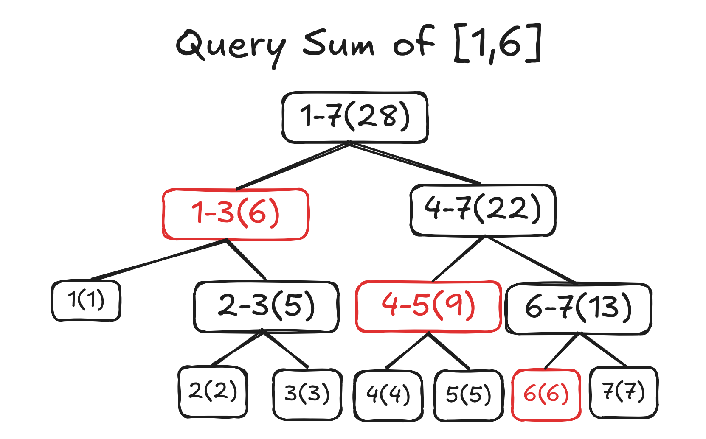

# 在 MoonBit 实现线段树（一）

## 引言

线段树(Segment Tree)是一种常见的数据结构，用于解决一些线性区间的修改、查询问题，比如对于问题：

- 给出一个长度已知的、有初值的数字数组，接下来要进行许多区间加法操作（将一个区间的数值都加上某个值）和区间求和操作（求该区间数值的和并输出）

如果该问题使用正常的数组方式来遍历求解，假设该数组长度为 N，每次修改和查询的操作耗时是 O(N)的；但线段树经过 O(N log N) 的构建之后，可以对上述两个操作做到 O(log N) 的优秀复杂度，足以体现其在区间问题上的重要性。

当然上面的例子只是线段树可以解决的一个简单问题，它可以做到的更复杂、更有趣的事情还有很多。在接下来的几篇文章当中我们将会学习使用线段树的概念以及如何使用 MoonBit 实现它，最终我们将一步步实现一棵支持区间加法与乘法、并可以查询区间和、拥有不可变特性的线段树。

本节我们将学习线段树的基本原理以及如何使用 MoonBit 编写一棵最基本的支持单点修改、查询的线段树。

## 线段树是什么？

本节是纯粹的概念、理论内容，如果读者已经了解并且熟悉线段树的构成与其原理，可以直接阅读下一节内容。

就像引言当中所说的，线段树可以解决一类区间问题，但他长什么样子，能做到如此优秀复杂度的原理又是什么呢？

我们以下图一个线性的数字序列为例，如果我们希望以它建立一棵线段树，那么它将会长这个样子：


可以看到我们把一个线性序列的区间层层分而治之，每次分割为两个对等（如果是奇数则一边多一个）的两个区间（区间范围下标在图示中），最终直到分割为长度为一的区间，并且在此过程中计算了其中每个区间元素的加和（在括号中），这样就从一个线性序列创建了一棵支持查询区间和线段树。

那么在查询区间和的时候，它如何工作呢？我们以查询区间 1-6 的和为例：



可以发现图中的标红部分加起来就等于区间 1-6 的区间和，而我们并没有统计到所有元素，只是选取了最少的区间来频出我们需要求解的区间，并且把我们要求的结果（此处为和）合并起来即可得到最终解。而我们只需要从上到下遍历这棵线段树来判断区间之间的交集/包含关系即可选择到符合条件的区间。

具体来说：

- 首先询问区间 1-7 与 1-6 的关系，显然后者为前者的子集，当前 1-7 的数据不能用于统计，因此继续向下遍历两个子节点。
- 再询问 1-3 与 1-6 的关系，前者为后者的子集，可以作为解的一部分，统计入当前结果中。
- 接下来询问 4-7 与 1-6 的关系，二者有交集，因此要继续向下遍历两个子节点。
- 然后询问 4-5 与 1-6 的关系，此处与第三条一致。
- 以此类推...

根据二进制分解的知识，我们对任何长度为 N 的区间最多只会求解 Log N 个区间，因此复杂度是可以保证的。

这里仅聊到查询操作，关于线段树上的修改操作的原理和实现我们将会在下一节详细说明。

## 实现

### 基础定义

我们采用一个非常经典的方法来表达线段树：

```rust
enum Node {
    Nil
    Node(Int, Node, Node)
} derive(Show)
```

其中 `Nil` 代表空树，而一个 `Node` 则包含一个它所储存的数据（为 Int 类型）和左右两个节点。

此外，我们还为他 derive 了 Show Trait，我们在遇到问题时可以直接输出这棵树来调试，这样非常直观且方便。

### 建树

建树是指将一个线性序列抽象为线段树的过程，一般将其称为 `build` 。

作为前置，我们应该根据需求为 `Node` 类型编写一个 `op_add` 的重载来配合下面建树的过程：

```rust
fn op_add(self : Node, v : Node) -> Node {
    match (self, v) {
        (Node(left, _, _), Node(right, _, _)) => Node(left + right, self, v)
        (Node(_), Nil) => self
        (Nil, Node(_)) => v
        (Nil, Nil) => Nil
    }
}
```

定义这一运算之后就可以轻松的向上合并两个 `Node` 节点，并在此过程中维护区间的和，为我们建树打下了基础，在有些线段树的叙述当中，这个过程也叫做 `pushup` 。

我们可以用 MoonBit 的 `ArrayView` 特性（某些语言当中也叫做 `slice` ）作为参数来低成本的取出一个线性结构的一段进行递归建树，这个过程是 `O(N Log N)` 的：

```rust
fn build(data : ArrayView[Int]) -> Node {
    if data.length() == 1 {
        Node(data[0], Nil, Nil)
    } else {
        let mid = (data.length() + 1) >> 1
        build(data[0:mid]) + build(data[mid:])
    }
}
```

分析一下这段代码：

- 首先如果当前长度已经为 1，就证明该区间不再需要细分，直接返回左右分支为空的叶子节点。

- 否则就证明该区间还可被分割，则求其中间值将其分割为两个区间分而治之的建树再通过 `Node` 之间的加法合并。

这段代码是非常简洁、可读性非常高的，而且对优化非常友好，可以作为后续其他数据结构的范式学习。

让我们来建立一棵树并输出看看：

```rust
fn main {
    let tree = build([1, 2, 3, 4, 5][:])
    println(tree)
}
```

运行后的输出是：

```bash
Node(15, Node(6, Node(3, Node(1, Nil, Nil), Node(2, Nil, Nil)), Node(3, Nil, Nil)), Node(9, Node(4, Nil, Nil), Node(5, Nil, Nil)))
```

漂亮，我们已经成功完成了建树的过程！

### 查询

接下来我们要编写查询，因为这棵线段树的节点向上合并时维护的是区间和，因此我们可以编写一个 `query` 函数来查询它：

```rust
let empty_node : Node = Node(0, Nil, Nil)

fn query(self : Node, l : Int, r : Int, query_l : Int, query_r : Int) -> Node {
    if query_l > r || l > query_r {
        empty_node
    } else if query_l <= l && query_r >= r {
        self
    } else {
        let Node(_, left, right) = self
        let mid = (l + r) >> 1
        left.query(l, mid, query_l, query_r) +
        right.query(mid + 1, r, query_l, query_r)
    }
}
```

首先，`l` 与 `r` 是当前函数中已经查询到的区间， `query_l` 与 `query_r` 是需要查询的区间，让我们来尝试解析一下这段实现：

- 如果需查询的区间和当前的区间状态为互不相交，则对解没有贡献，我们定义了一个 `empty_node` 来表示 0 贡献节点，将其返回则为无贡献。

- 如果当前区间就是需查询区间的子集，那么实际上对解的贡献就是它自己，直接返回它即可。

- 如果当前区间和需要查询的区间存在交集关系，那么需要继续向下搜索来确定准确的覆盖，因此继续求出中间值向下搜索并且合并两边的 `Node` 结果。

### Q&A

- Q: 为什么要用 `Node` 作为返回值，我用相同的逻辑也可以直接把 `Node` 当中的值给解构出来相加呀？

- A: 首先，我们为 `Node` 已经编写了加和运算，不妨考虑一种情况，我们不止要维护区间和，而是要同时维护区间和还有区间最小值，这时候我们只需要更改 `Node` 的 `op_add` 逻辑来维护最小值即可，而 `query` 函数和我们要维护的数据没有关系，它最终返回的是一个 `Node` ，它可以求出所有信息！所以不妨就让我们使用 `Node` ！

- Q: 你说的这种情况 `empty_node` 是不是也要改变？

- A: 对， `empty_node` 是用来保证它和任何其他 `Node` 相加都不会产生改变的元素，是一个零贡献的`Node` ，类比在维护区间和的时候零贡献是 0，那么其实对于维护最小值来说你的值是当前可以取到的最大值，那就是零贡献的，这个过程处理的其实很灵活！

让我们来测试一下这个查询过程：

```rust
fn main {
    let tree = build([1, 2, 3, 4, 5][:])
    let sum = match tree.query(1, 5, 1, 3) {
        Node(sum, _, _) => sum
        _ => panic()
    }
    println(sum)
}
```

输出是：

```bash
6
```

太好了，我们得到了正确的输出！

### 代码

完整代码见下

```rust
enum Node {
    Nil
    Node(Int, Node, Node)
} derive(Show)

let empty_node : Node = Node(0, Nil, Nil)

fn op_add(self : Node, v : Node) -> Node {
    match (self, v) {
        (Node(left, _, _), Node(right, _, _)) => Node(left + right, self, v)
        (Node(_), Nil) => self
        (Nil, Node(_)) => v
        (Nil, Nil) => Nil
    }
}

fn build(data : ArrayView[Int]) -> Node {
    if data.length() == 1 {
        Node(data[0], Nil, Nil)
    } else {
        let mid = (data.length() + 1) >> 1
        build(data[0:mid]) + build(data[mid:])
    }
}

fn query(self : Node, l : Int, r : Int, query_l : Int, query_r : Int) -> Node {
    if query_l > r || l > query_r {
        empty_node
    } else if query_l <= l && query_r >= r {
        self
    } else {
        let Node(_, left, right) = self
        let mid = (l + r) >> 1
        left.query(l, mid, query_l, query_r) +
        right.query(mid + 1, r, query_l, query_r)
    }
}

fn main {
    let tree = build([1, 2, 3, 4, 5][:])
    let sum = match tree.query(1, 5, 1, 3) {
        Node(sum, _, _) => sum
        _ => panic()
    }
    println(sum)
}
```

## 总结

今天我们学习了如何编写一棵简单的线段树的构建和查询操作的编写，下一节课我们将会学习更加复杂的线段树的原理和实现，感兴趣的读者可以在阅读文章之后自行实现下面内容来巩固知识和拓展更多内容：

- 尝试实现一个可以维护多个信息（如区间和、区间最大值最小值）的线段树。
- 自行了解如何实现线段树的单点查询/修改操作并实现。
- 自行了解线段树的区间修改操作以及 LazyTag 的相关知识。
