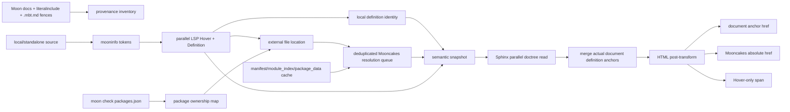

# MoonBit 文档语义导航实施计划

状态：可直接实施

最后更新：2026-07-11

当前里程碑：文档代码块中的 Markdown Hover，以及从文档代码块跳转到文档内定义或 Mooncakes.io 精确符号页

## 1. 最终决策

这个项目不再生成 Hackage 风格的本站源码页，也不再生成 source index、target-set page 或 literate source page。Mooncakes.io 已经提供标准库和已发布依赖的符号展示页；本站只负责确定文档代码块中的 occurrence 应该跳到哪个定义。

最终导航只有两个目的地：

1. local/standalone 定义确实出现在某个文档语义代码块中时，跳到该文档页上的稳定定义锚点；
2. dependency/stdlib 定义可以被 Mooncakes 的版本化索引精确、唯一地确认时，跳到 Mooncakes 的符号锚点。

除此之外不生成链接。没有链接不影响 Hover；不支持的 symbol kind、未发布 package、私有 symbol、歧义结果和临时网络失败都保留语义 Hover，但保持普通 `<span>`，不伪造目标。

这取代旧计划中的以下设计：

- `_moonbit-src/**` 全量冻结源码页；
- dependency/stdlib display-only 页面；
- `.mbt.md` 的第二套 literate source page；
- 多目标静态中转页；
- MoonBit source/symbol Sphinx index；
- `View Source` 控件；
- 为源码站单独复制或设计高亮方案。

## 2. 范围和不变量

### 2.1 当前必须完成

- 只对 local 和 standalone 文件发起 token、Hover 和 Definition LSP 请求；
- `.mbt.md` 继续按文学编程输入处理：Markdown prose 由现有 MyST/Sphinx 文档流程渲染，MoonBit fence 通过 provenance 投影获得语义；
- `.mbt` 没有 Markdown prose，只在被文档 include 或以其他有 provenance 的方式展示时获得 overlay；
- 普通手写 fence 如果无法证明它对应 snapshot 中的源区间，就保持现有词法高亮，不附会语义；
- dependency 和 stdlib 不作为 occurrence analysis 起点；
- LSP 从 local/standalone occurrence 返回 dependency/stdlib location 时，仍解析该 target 的 module、version、package、symbol 和 Mooncakes URL；
- 构建产物只包含正常 Sphinx 文档页、Hover 静态资产和已有站点资产；
- HTML 中所有 Definition `href` 在构建结束时已经确定，浏览器运行时不请求 Mooncakes API。

### 2.2 明确不做

- 不分析 dependency/stdlib 文件内的 occurrence；
- 不为 dependency/stdlib 生成 Hover overlay；
- 不生成本站源码页面或全文源码搜索；
- 不补做 Mooncakes 尚未提供的锚点；
- 不通过 GitHub 行号、`file://`、猜测的行号或 200 响应兜底；
- 不改写现有文档正文，也不要求修改被 include 的源代码；
- 不建立第二套 MoonBit lexer、高亮颜色或 Markdown renderer；
- 不在本里程碑修复 Mooncakes SPA 的深链接滚动时序。

### 2.3 `.mooncakes`、dependency 和 stdlib 的正确角色

不能忽略 `.mooncakes`。它不再是要发布的源码 corpus，也不作为语义扫描输入，但它仍是 local consumer 的已解析依赖图和 LSP Definition location 的物理落点。

`moon check` 生成的 `packages.json` 是当前 consumer context 的权威映射：

```text
Definition file URI
  -> realpath
  -> packages.json 中最长匹配的 package fspath/root-path
  -> package path，例如 moonbitlang/async/http
  -> module + resolved version，例如 moonbitlang/async@0.19.2
```

stdlib 同理。`$MOON_HOME/lib/core/cmp/cmp.mbt` 的物理位置只用于确认它属于 `moonbitlang/core/cmp`；最终 HTML 绝不暴露该路径。

## 3. 用户可见行为

### 3.1 Hover

Hover 保持已经实现的 rich Markdown 流程：

```text
LSP MarkupContent
  -> snapshot 中的去重 Hover payload
  -> Sphinx 构建期 MyST Markdown 渲染
  -> 使用文档站既有 MoonBit lexer/Pygments 和主题 CSS
  -> 清理后的静态 HTML fragment
  -> content-addressed JS payload
  -> 浏览器 popover
```

Hover 中递归出现的 `mbt`/`moonbit` fence 继续复用文档站的高亮器。运行时不解析 Markdown，不执行 LSP HTML，不加载远程图片或本地 include。

### 3.2 Go to definition

鼠标点击和键盘激活都使用普通 `<a href>`：

| Target | 条件 | 输出 |
|---|---|---|
| local/standalone | symbol definition 实际渲染在至少一个文档语义 block 中 | 相对文档 URL + `#mb-def-*` |
| dependency/stdlib | Mooncakes resolver 返回唯一 `exact` target | 绝对 `https://mooncakes.io/docs/...#...` |
| 多个 LSP target | 去重后全部指向同一个最终 URL | 该唯一 URL |
| 多个不同目标 | 当前无法无歧义选择 | 无 `href` |
| Mooncakes 不支持 | 没有稳定锚点 | 无 `href` |
| local definition 未被文档展示 | 本站没有真实目的地 | 无 `href` |
| 无 definition | LSP 没有目标 | 无 `href` |

同一个 local symbol 如果被多个文档页真实展示，选择按 docname 排序后的第一个页面作为 canonical 文档目的地。每个页面只为同一个 `symbol_id` 输出一次 DOM `id`，避免重复锚点。

### 3.3 不带 provenance 的 fence

没有文学编程来源或 include provenance 的 fence 没有语义信息是正常行为。它继续使用原有 Sphinx/Pygments 高亮，不显示 Hover，也不生成 Definition 链接。

## 4. Mooncakes 的公开路由合同

### 4.1 URL

稳定输出格式：

```text
core:
https://mooncakes.io/docs/moonbitlang/core/<package-suffix>#<anchor>

third party:
https://mooncakes.io/docs/<module>@<exact-version>/<package-suffix>#<anchor>
```

例子：

```text
https://mooncakes.io/docs/moonbitlang/core/cmp#maximum
https://mooncakes.io/docs/moonbitlang/async@0.19.2/http#ServerConnection::send_response
```

`::` 必须原样保留在 fragment 中，不能变成 `%3A%3A`。路径 segment 必须按 URL path 规则编码，fragment 只允许 resolver 已确认的 Mooncakes anchor。

### 4.2 版本规则

- `moonbitlang/core`：Mooncakes 文档路由使用不带版本的 canonical URL；解析资产固定到构建时 manifest 的 `latest_version`，snapshot 记录这个 `resolved_version`；
- 非 core module：必须使用 `packages.json`/module metadata 中的精确 resolved version；该版本必须存在于 Mooncakes manifest，并且对应版本化 `module_index.json` 和 package data 必须可读；
- 非 core 缺少版本时不回退到 latest；
- core 本地 toolchain bundle 与 Mooncakes latest 可能不完全同一 revision；精确位置不匹配时直接跳过，不按同名或邻近位置猜测。

### 4.3 不能用 HTTP 200 验证链接

Mooncakes 是 SPA。不存在的 `/docs/...` 路径或 fragment 仍可能返回 200 shell，因此 resolver 必须使用以下证据闭包：

1. `/api/v0/manifest/<module>@<version>/<package-suffix>` 确认非 core 的精确 package/version，或用 `/api/v0/manifest/moonbitlang/core/<package-suffix>` 确认 core latest package；
2. `/assets/<module>@<version>/module_index.json` 确认 package 和公开 symbol catalog；
3. `/assets/<module>@<version>/<package-suffix>/package_data.json` 确认具体 declaration、location 和 anchor owner；
4. 只有 manifest、catalog 与 package data 能从精确 location 得出一个相同、唯一、稳定的 anchor 时才产生 `exact` URL。

### 4.4 当前支持的 symbol

当前允许：

- package 顶层 value/function；
- type；
- trait 本身；
- error 本身；
- typealias；
- Mooncakes `misc` 中有独立顶层锚点的声明；
- type/error/misc 直接拥有、并在 package data 中可唯一确认的方法，锚点为 `Type::method`。

当前跳过：

- struct/enum field；
- enum constructor/variant；
- operator 或无法稳定编码的符号；
- trait member；
- impl-only method，尤其同名或跨 trait overload；
- private/internal declaration；
- package catalog 与 location 证据不一致的 declaration；
- Mooncakes 没有独立 DOM id 的任何对象。

“跳过”表示保存可审计状态但不输出 `href`，不是报错，也不是降级到源码行。

## 5. 构建期数据流



关键分界：

- Moon 工具链和网络只存在于 snapshot/index 阶段；
- Sphinx 只读取完整、固定的 snapshot；
- 浏览器只消费 HTML 和 Hover 静态资产；
- Mooncakes 页面是最终 Definition 展示后端，不是本站构建输入。

## 6. package ownership 映射

### 6.1 从 `packages.json` 收集

为每个 checked root 收集：

- package 自身：`root + rel` 为逻辑 package path，`root-path` 为物理 package root；
- `deps`、`wbtest-deps`、`test-deps`：`path` 为逻辑 package path，`fspath` 为物理 package root；
- 顶层 dependency 记录中同等含义的 `path/fspath`；
- realpath alias：多个 consumer 的 `.mooncakes` 副本可映射到同一 module/version，但每个物理前缀都保留 ownership entry。

冲突处理：

- 对 target file 使用最长物理前缀匹配；
- 同一物理 root 映射到不同逻辑 package 时标记 `ambiguous-package`；
- package 必须等于 module 或以 `module/` 开头；
- dependency module/version 来自已解析 module root，而不是从路径字符串猜；
- 只有在 metadata 缺失时，才允许用 module root 下的相对目录进行保守推断，并必须再由 Mooncakes catalog 精确确认。

### 6.2 Definition location 归一化

每个外部 LSP location 归一化为：

```json
{
  "module": "moonbitlang/core",
  "requested_version": "0.1.20260629+...",
  "package": "moonbitlang/core/cmp",
  "file": "cmp.mbt",
  "line": 103,
  "column": 21,
  "name": "maximum"
}
```

行列来自冻结 target blob 和 UTF-8 selection range，转成 1-based Unicode scalar column，与 Mooncakes `loc` 合同对齐。`name` 必须是 selection range 的原始文本，不能从 Hover 文本猜测。

## 7. Mooncakes resolver 与缓存

### 7.1 两阶段解析

LSP worker 不直接阻塞等待网络：

1. LSP 阶段把外部 target 归一化为 resolution key；
2. 所有 context 分析结束后，对 resolution key 去重；
3. 用有界线程池并行解析不同 module/package；
4. 相同 manifest、module index 和 package data 只读取/下载一次；
5. 把结果回填到 occurrence definition，并写入去重 external target table。

这样网络请求数取决于被引用 package 数，而不是 occurrence 数。

### 7.2 本地缓存

默认缓存目录：`.semantic-cache/mooncakes/`，不进入最终 HTML。缓存键至少包含完整资产 URL；缓存文件保存响应 JSON 和校验 digest。写入使用同目录临时文件加原子 rename。

模式：

- online（默认 semantic recipe）：带精确版本的 dependency manifest 和 assets 在 cache hit 时直接使用；core manifest URL 不带版本，因此每个 client 生命周期重新验证一次，再按返回版本读取 immutable assets；
- offline：所有 URL 只读 cache，miss 产生 `offline-miss`，不产生链接；
- refresh：显式绕过全部 provider cache；这是排障/强制刷新开关，不是默认 recipe。

并发要求：同一进程中同一个 URL 只有一个 in-flight fetch，其他 worker 等待结果；失败结果在本次构建内也缓存，避免请求风暴。

### 7.3 解析结果

```json
{
  "external_target_id": "mooncakes:sha256:...",
  "provider": "mooncakes",
  "module": "moonbitlang/async",
  "requested_version": "0.19.2",
  "resolved_version": "0.19.2",
  "package": "moonbitlang/async/http",
  "anchor": "ServerConnection::send_response",
  "url": "https://mooncakes.io/docs/moonbitlang/async@0.19.2/http#ServerConnection::send_response",
  "match": "location",
  "status": "exact"
}
```

非 exact 结果只作为 definition 上的审计字段或 diagnostics 保存：

```text
unsupported-kind
package-not-published
version-not-published
package-not-indexed
symbol-not-indexed
ambiguous-symbol
location-mismatch
unavailable
unavailable-offline
```

## 8. Snapshot 变更

增加可选 `external-targets.jsonl`。每个 exact route 只保存一次，occurrence definition 通过 `external_target_id` 引用；同一记录同时保留 `external_status`，便于统计被跳过的原因。

Definition target 保持原有 local location 字段以便审计：

```json
{
  "target_source_id": "dependency:moonbitlang/async@0.19.2:http/server.mbt",
  "target_selection_range_utf8": [123, 136],
  "symbol_id": "sym:...",
  "external_target_id": "mooncakes:sha256:...",
  "external_status": "exact"
}
```

约束：

- `external_target_id` 必须引用存在且 `status == exact` 的记录；
- URL scheme/host 必须精确为 `https://mooncakes.io`；
- URL path 必须处于 `/docs/`；
- external record 的 module/version/package/anchor 重新组装后必须等于保存的 URL；
- external record 的 module/requested version 必须与 definition target source 身份一致；
- local/standalone target 不得带 external target；
- snapshot manifest 统计 exact external targets 和各 skip reason；
- Sphinx loader 兼容没有 external table 的旧 snapshot，此时只有 Hover 和文档内 local link 可用。

Sphinx 不读取 cache，也不尝试重新解析 URL。

## 9. Sphinx 两阶段实现

### 9.1 builder 初始化

保留：

- snapshot 加载与校验；
- Hover Markdown 的构建期渲染；
- content-addressed Hover JS；
- semantic CSS/JS 注册。

删除：

- source prefix 配置；
- virtual literate source doctree；
- source/symbol index 注册；
- `html-collect-pages`；
- source page output validation 和 stale cleanup；
- snapshot literate asset 复制。

缺少可选 snapshot 时警告改成“semantic overlays are disabled”，不再提 source pages。

### 9.2 doctree-read：发现真实定义目的地

在 provenance 和 range 校验成功，并且该 literal block 能被 semantic post-transform 支持时：

1. 投影 snapshot occurrences 到展示文本；
2. 把 pickle-safe occurrence 数据附到 literal block；
3. 收集 `role == definition && symbol_id != null`；
4. 向 Sphinx domain 记录 `symbol_id -> {docname}`；
5. 记录文档到 source 的使用关系供 incremental purge。

必须排除 post-transform 不会接管的 block，例如当前仍需保留 Sphinx 原生表现的 `linenos`/`hl_lines` block；否则会注册一个最终不存在的锚点。

### 9.3 parallel-read 合并

Domain 只保存真实文档定义：

```text
definitions: symbol_id -> set(docname)
doc_definitions: docname -> set(symbol_id)
```

- `clear_doc` 删除该 docname 贡献的全部 symbol；
- `merge_domaindata` 只合并当前 worker 读取的 docnames；
- 集合内容完全可 pickle；
- 所有 read worker 完成并合并后，write/post-transform 才解析最终 href；
- 不在 worker 中缓存相对 URI。

### 9.4 post-transform：最终 href

对 occurrence 的 Definition targets 依次得到候选 URL：

- external exact：直接读取 snapshot external target URL；
- local/standalone：根据 target `symbol_id` 查询 domain，选 canonical docname，调用 builder 的相对 URI API，再附稳定 anchor；
- 其他：没有候选。

候选去重后：

- 0 个：Hover-only span；
- 1 个：输出 `<a>`；
- 多个不同 URL：Hover-only span。

Definition anchor 仍使用 `mb-def-<readable>-<digest>`，但 renderer 每个 docname 对同一 symbol 只输出一次。

## 10. 删除本站源码页

实施时删除或收缩：

- `next/_ext/moonbit_semantic/source_pages.py`：拆出仅剩的 lifecycle/asset 逻辑后删除；
- `next/_ext/moonbit_semantic/literate.py`：它只服务于第二套 literate source page，删除；
- `next/_ext/moonbit_semantic/templates/moonbit-source.html`：删除；
- `routing.py`：只保留稳定 symbol anchor；
- `domain.py`：改为 document definition registry，不再暴露 source/symbol indices；
- `render.py`：去掉 source-page/line-number 专用分支；
- CSS：删除 `.mbt-source-*`、source line gutter 等规则；
- `next/conf.py`：删除 `moonbit_semantic_source_prefix`，关闭无用的主题 `View Source` 按钮；
- 测试：所有 `_moonbit-src` 断言改成“该目录不存在”，Definition 目标改为文档 anchor 或 Mooncakes URL。

Snapshot 中暂时可以继续保存 external target 的冻结 source blob，用于 index-time location 校验和旧格式兼容；Sphinx 不再渲染它。后续可以在不改变 HTML 数据流的情况下，把 external source 缩减为 definition evidence table，进一步减小 snapshot。

## 11. 安全与正确性

- 只有 provenance 与 blob digest 匹配的文档 block 才获得语义；
- 所有 range 使用原始 UTF-8 byte offset，并验证字符边界；
- Mooncakes URL 由结构化字段组装，不接受 LSP/Markdown 提供的 URL；
- snapshot loader 对 host、path、fragment 和 record 引用做 fail-closed 校验；
- Hover HTML 仍在构建期清理；
- HTML 不包含 `file://`、repo absolute path、`.mooncakes` absolute path 或 `$MOON_HOME`；
- Sphinx build 不联网，所以可复现性由 snapshot digest 决定；
- unsupported/ambiguous 永远不猜测；
- 多目标只在最终 URL 完全相同时合并。

## 12. 性能模型

旧流程的主要额外成本是 2,000 多个 additional HTML pages、全量模板/主题处理、页面校验和磁盘写入。新流程删除这部分。

新成本：

- LSP：与当前 local/standalone-only 流程相同；
- ownership map：线性扫描 `packages.json` package/dependency entries；
- Mooncakes：按唯一 module/package 缓存和并行请求，不按 occurrence 请求；
- Sphinx：只对实际文档代码 block 做已有 range projection；
- HTML：不再输出 `_moonbit-src`，通常减少约 100 MiB 和数十秒到数分钟的 clean build 工作。

必须在 E2E 报告中记录：

- local/standalone source、candidate、Hover、Definition request 数；
- external Definition edge 数和唯一 resolution key 数；
- Mooncakes cache hit/miss、请求数、耗时；
- exact URL 数与各 skip reason；
- 实际文档 definition anchor 数；
- 带 Hover token、带 Definition link token 数；
- Sphinx 总页面数、输出大小和 wall time。

## 13. 已知 Mooncakes 滚动问题

### 13.1 现象

直接打开带 fragment 的 Mooncakes SPA 路由时，目标 DOM id 最终存在，但页面偶发停留在顶部。刷新或稍后再次导航有时恢复。core 路由比固定版本的第三方路由更容易观察到。

### 13.2 推测的数据竞争

路由先处理 fragment，package data 和页面布局异步完成；如果第一次 `scrollIntoView` 发生在目标节点挂载、字体/内容撑开或滚动容器稳定之前，就不会再次滚动。这是根据源码与交互行为做出的推断，不是本站能够可靠修复的部分。

### 13.3 可用于上游 issue 的复现记录

```text
1. 新开无缓存浏览器 tab。
2. 直接访问 https://mooncakes.io/docs/moonbitlang/core/cmp#maximum。
3. 等待 package_data 和页面内容全部出现。
4. 检查 document.getElementById("maximum") 存在。
5. 观察滚动位置偶发仍接近 0。
6. 对比固定版本的第三方 URL，并记录浏览器、网络 throttling 和录屏。
```

建议上游在 route、package data 和布局稳定后重新执行一次 fragment scroll，或用目标节点挂载后的 effect/observer 保证至少一次成功滚动。本站只输出正确 canonical URL，不加入定时器、query 参数或中间页面规避。

## 14. Commit 分解

每个 commit 都必须可独立审阅，使用 conventional commit，并包含对应测试。

### Commit 1 — `docs: adopt Mooncakes definition routing`

- 用本文替换源码站计划；
- 固定范围、数据流、支持矩阵、缓存、已知滚动问题；
- 不改运行时代码。

### Commit 2 — `feat(semantic): resolve Mooncakes definition targets`

- 增加 package ownership 提取；
- 增加缓存式 Mooncakes client/resolver；
- 增加去重并行 resolution phase；
- 增加 external target snapshot table、validator 和 loader；
- CLI 增加 cache/offline/refresh 控制；
- unit tests 覆盖 core、固定版本 dependency、方法、unsupported、ambiguous、404/SPA 误判和 cache。

### Commit 3 — `feat(docs): link definitions to rendered documentation`

- Domain 改为并行安全的 document definition registry；
- doctree-read 只登记真实可渲染定义；
- post-transform 解析 local doc anchor 和 snapshot external URL；
- 多目标去重，歧义保持无链接；
- tests 覆盖同页、跨页、重复展示、未展示、parallel read、dirhtml。

### Commit 4 — `refactor(docs): remove semantic source pages`

- 提取 semantic lifecycle/asset 模块；
- 删除 source page、literate virtual page、template、indices 和配置；
- 删除 source-only CSS/renderer 分支；
- 关闭主题 View Source；
- 重写 integration/E2E assertions，确认 `_moonbit-src` 不存在。

### Commit 5 — `test(docs): verify Mooncakes semantic navigation`

仅在全量 fixture/E2E 需要独立收尾时使用：

- 构建真实 snapshot；
- strict Sphinx clean build；
- 静态爬取所有 semantic links；
- 校验 local fragment 存在；
- 校验 external URL 全部来自 exact table；
- 输出覆盖率和耗时报告。

如果 Commit 2–4 已各自包含充分测试，Commit 5 不强制制造空的测试提交。

## 15. 测试矩阵

### 15.1 Resolver unit tests

- core 顶层 `cmp#maximum`；
- third-party 固定版本和 `Type::method`；
- raw `::` fragment；
- exact location；
- core revision drift 导致位置不一致时安全跳过；
- 同名 direct method ambiguity；
- field/constructor/trait member/impl-only method skip；
- module/version/package 缺失；
- manifest 存在但 version asset 不存在；
- invalid JSON、timeout、offline miss；
- 相同 URL 并发只 fetch 一次；
- cache hit 不联网；
- 非 2xx docs shell 不参与验证。

网络测试只使用 fixture HTTP client 或录制的最小 JSON，不把 live Mooncakes 可用性变成 CI 条件。

### 15.2 Snapshot tests

- external target 确定性排序和 digest；
- dangling external ID 被拒绝；
- 非 Mooncakes host 被拒绝；
- URL 与结构化字段不一致被拒绝；
- local target 夹带 external route 被拒绝；
- 旧 snapshot 无 external table 仍可加载；
- manifest counts 与 skip statistics 一致。

### 15.3 Sphinx tests

- 同页 local reference 跳到真实 anchor；
- 跨页相对 URL；
- 同一 symbol 多页展示选择确定性 canonical page；
- 同页重复定义只输出一个 DOM id；
- local target 未展示时无 href；
- external exact 输出绝对 Mooncakes URL；
- unsupported external 仍有 Hover、无 href；
- 多个 target 同 URL 可链接；
- 多个不同 URL 不链接；
- `linenos`/`hl_lines` block 不注册假锚点；
- parallel=2 合并正确；
- html 与 dirhtml URI 正确；
- text/gettext/linkcheck 不注入 HTML-only 语义；
- `_moonbit-src` 不生成；
- Hover Markdown、高亮和 sanitization 回归不变；
- 不出现 View Source semantic control。

### 15.4 E2E 静态验证

遍历所有生成 HTML：

- 每个 `data-mbt-hover` 都存在 payload；
- Hover preload 位于 runtime script 之前；
- 每个内部 semantic `href#fragment` 的页面和 DOM id 都存在；
- 每个外部 semantic href 精确存在于 snapshot external table；
- 不允许其他 external definition host；
- 不允许 `file://` 和绝对本地路径；
- 不存在 `_moonbit-src` 目录；
- 至少有一个文档内 local Definition link；
- 至少有一个 core Mooncakes link；
- 若 fixture 含已发布 dependency，至少有一个带精确版本的 dependency link。

## 16. 完成标准

本里程碑只有在以下条件全部满足时完成：

1. strict semantic snapshot 可以从 clean checkout 构建并通过 validator；
2. stdlib/dependency 没有 occurrence-analysis session；
3. `.mooncakes` target 可以通过 package graph 正确归属；
4. 支持的 core/dependency symbol 写入 exact Mooncakes route；
5. 不支持或歧义 symbol 没有 href；
6. local definition 只有在真实文档 block 中存在时才成为目的地；
7. parallel Sphinx read/write 生成稳定相同 HTML；
8. Hover Markdown 和 MoonBit fence 高亮继续复用现有文档主题；
9. `_moonbit-src`、target-set、source index 和 source template 全部消失；
10. HTML 不泄漏本地路径，且所有内部 fragment 可静态闭合；
11. clean build 的页面数、输出大小和 wall time 明显下降；
12. Mooncakes 滚动 race 记录在本文，但不阻塞发布。

## 17. 后续扩展点

未来 Mooncakes 若为 field、constructor、trait member 或 impl method 提供稳定、公开且可从 index 验证的 anchor，只需扩展 resolver 的 supported catalog。数据流不变：

```text
更大的 Mooncakes 支持矩阵
  -> 更多 exact external target records
  -> 相同 snapshot consumer
  -> 相同 Sphinx href resolver
```

未来若把整套文档迁入 Mooncakes ecosystem，也可以直接复用 snapshot 中的 occurrence、Hover 和 canonical external target identity；本站不拥有源码页面，因此不存在 URL 迁移或双源 canonical 冲突。

## 18. 2026-07-11 实现与验收基线

本里程碑已经按上面的数据流落地。实现拆分为以下提交：

1. `4bde38aa docs: adopt Mooncakes definition routing`
2. `0feabf42 feat(semantic): resolve Mooncakes definition targets`
3. `7b3ad0b9 feat(docs): link rendered semantic definitions`
4. `bac79eb2 refactor(docs): remove semantic source pages`
5. `79d2736a perf(docs): enable parallel semantic HTML builds`

验收与独立审查后的加固提交：

- `51e53b00 docs: record semantic navigation baseline`
- `26d82417 fix(docs): remove broken source download links`
- `651c0ba6 fix(semantic): revalidate core Mooncakes manifests`
- `2512f771 fix(semantic): bind external targets to source identity`

### 18.1 全量语义索引

在 clean checkout 上执行 `just semantic-index` 的实测结果：

| 指标 | 数值 |
| --- | ---: |
| wall time | 约 223.2 秒 |
| source files | 2,075 |
| analysis contexts | 572 |
| symbols | 4,569 |
| hovers | 1,567 |
| occurrences | 17,324 |
| definition requests | 17,665 |
| Mooncakes unique positions | 261 |
| Mooncakes exact targets | 187 |
| Mooncakes unsupported/skipped | 74 |
| frozen literate assets | 0 |

这 223 秒不是 Mooncakes 网络解析造成的：261 个去重位置以 16 workers 解析约 8.3 秒。主要耗时是 279 个含 occurrence 的本地 analysis context 仍按 context 串行启动和驱动 LSP；大型 context 内已经使用 8 个 session。下一阶段若要显著加速，目标应是 context-level scheduler，而不是扩大单 context 的 session 数，也不是重新分析 stdlib/dependency occurrence。

当前 74 个 unsupported 结果按 fail-closed 合同保留 Hover 但不生成 `href`。它们不是错误，也不会降级成按名字猜测的 Mooncakes 链接。

### 18.2 HTML 构建与静态闭包

`make clean html SPHINXOPTS="-j auto"` 的实测 wall time 约 15.7 秒，构建 347 个 Sphinx source documents；现有 16 条文档 warning 与本功能无关。生成物统计为：

| 指标 | 数值 |
| --- | ---: |
| HTML pages | 351 |
| semantic code blocks | 669 |
| Hover-bearing tokens | 12,334 |
| definition anchors | 2,831 |
| semantic links | 9,074 |
| local definition links | 8,722 |
| Mooncakes links | 352 |
| unique Mooncakes URLs | 89 |
| HTML size | 约 33 MiB |

静态 E2E 已验证：

- 所有本地 definition fragment 都能在目标 HTML 中闭合；
- 所有外部 definition href 都精确来自 snapshot external target table；
- 不存在 `_moonbit-src`、`_moonbit-source` 或 Sphinx `_sources` 输出；
- 不存在 `file://` 或绝对本地路径泄漏；
- `.mbt.md` 继续由普通 MyST include 处理 prose，内部 MoonBit fence 接收相同语义渲染；
- Hover Markdown、嵌套 MoonBit fence 高亮和 sanitization 的既有测试继续通过。

自动化 in-app browser 的 URL policy 不允许打开本地 `file://` 构建产物，因此没有把一次真实外部点击作为 CI/验收条件；链接行为由生成 HTML 的精确 href、snapshot 合同和静态 fragment crawl 验证。Mooncakes SPA 的 fragment 滚动 race 仍按第 13 节记录为上游问题，不影响本站是否输出正确 URL。

### 18.3 验收命令

```bash
uv run --with-requirements next/requirements.txt --with pytest \
  pytest -q tests/semantic_docs
just semantic-index
just semantic-check
cd next
MOONBIT_SEMANTIC_E2E=1 uv run --with-requirements requirements.txt \
  --with pytest pytest -q ../tests/semantic_docs/test_integration_config.py
make clean html SPHINXOPTS="-j auto"
```

live Mooncakes smoke test 只用于人工确认公开服务当前路由，不进入 CI；CI 中 resolver 继续使用确定性 fixture，避免把外部服务可用性变成文档构建条件。
