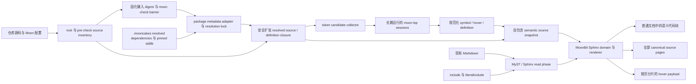

# MoonBit 语义化代码文档实施计划

状态：Proposed

范围：`next/` Sphinx 文档站点、`next/sources/` 中的 MoonBit 示例，以及它们解析后的 MoonBit 依赖闭包

目标功能：代码 Hover、Go to definition、Hackage 风格的语义化源码页

## 1. 结论与不可变约束

本方案采用“构建期语义分析、静态快照、Sphinx 渲染”的两阶段架构。

核心结论如下：

1. MoonBit 工具链在 Sphinx HTML 构建之前完成语义分析；浏览器和 Sphinx 都不实时调用 LSP。
2. 分析结果持久化为项目自有、版本化、自包含的 semantic source snapshot。Snapshot 同时保存语义区间和分析时使用的精确源码字节。
3. Sphinx 扩展可以进行侵入式改造，包括覆盖 `literalinclude`、注册 domain 和自定义 node、接管 HTML code renderer、添加模板和静态资源、生成额外页面。
4. 现有文档 Markdown 及其引用的 MoonBit 源文件不得为了语义功能而增加标记、ID、front matter 或特殊 directive，也不得改写其内容。
5. 每个进入 semantic snapshot 的 local、dependency 和 stdlib source 都必须生成一个 canonical source page；不允许用外部仓库链接代替已解析依赖或标准库源码页。页面是否被任何文档引用，不影响它是否生成。
6. Go to definition 的规范目标是源码页上的定义锚点，而不是某个偶然展示该定义的文档代码块。
7. 文档中的代码块只是源码区间的投影视图；它与完整源码页共享同一份 occurrence、hover 和 definition 数据。
8. 纯源码文件（如 `.mbt`）使用 Hackage 风格的 code-only source page；`.mbt.md` 是文学编程文档，必须保留并渲染 Markdown prose，同时只在其中的 MoonBit code blocks 叠加语义信息。
9. 没有语义信息的代码仍按现有方式显示和高亮；不得制造猜测性的 Hover 或无效 Definition 链接。
10. Markdown、gettext、LaTeX/PDF、EPUB、linkcheck 等非目标 builder 必须保持原有行为。

这里的“非侵入”只约束文档内容与被引用源码，不约束扩展实现和构建流水线。

## 2. 目标体验

### 2.1 文档页面中的代码块

对于能够映射到 semantic snapshot 的 MoonBit token：

- 鼠标悬停、键盘聚焦或触摸点击时显示签名、类型和文档；
- 标识符使用普通 `href` 指向定义，禁用 JavaScript 后仍可跳转；
- provenance 已知的代码块必须提供指向 canonical source page 的 “View source” 链接；具体入口样式和位置可以由主题集成决定；
- 复制、选择、换行、caption、Pygments 样式和现有 copybutton 行为不变。

无法确定 package context、source provenance 或 source hash 不匹配时，该代码块自动退化为现有普通高亮。

### 2.2 Hackage 风格源码页

纯源码文件的源码页主体只展示代码，不承载 API 正文或教程内容。可以保留极简的文件路径、package/version、license attribution 和返回文档的导航。

`.mbt.md` 使用单独的 literate source page：Markdown prose、标题、列表、链接和其他文档结构按 MyST/Sphinx 规则渲染，MoonBit fence 渲染为带语义信息的代码块。它不是 raw Markdown dump，也不是删除 prose 的代码投影；front matter 作为页面元数据处理，fence delimiter 不作为可见正文。

| Source kind | Canonical page | Semantic behavior |
|---|---|---|
| `.mbt` | Hackage 风格 code-only page | 完整 Hover/Definition |
| `.mbti` | code-only page | provider 支持时完整语义，否则显式 display-only |
| `.mbtp` | code-only page | proof provider 支持时完整语义，否则显式 display-only |
| `.mbt.md` | 保留 Markdown prose 的 literate page | 在可分析 MoonBit code blocks 中提供语义 |
| generated pure source | code-only page | 按真实 source kind/provider 处理 |
| virtual inline unit | code-only synthetic page | 仅在 Phase 4 context 可确定时生成 |

每个源码页必须具有：

- canonical、可预测、包含依赖版本身份的 URL；
- 每个展示代码行对应的原始文件行锚点；
- 全局定义和局部 binding 的唯一锚点；
- 引用到定义的真实 `href`；
- 与文档代码块一致的 Hover；
- 同一符号引用的可选联动高亮；
- 没有语义数据时仍完整可读的词法高亮代码。

源码页不是 `literalinclude` 的兜底。它是 definition navigation 的主要目的地，也是当前仓库完全缺失的新输出类型。

## 3. 当前系统与缺口

当前文档数据流可概括为：

```text
next/sources 下的 MoonBit 工程
  ├─ scripts/check-document.py / next/check_error_docs.py 独立校验
  └─ Markdown 通过 include / literalinclude 引用
                         ↓
MyST + Sphinx read phase
  ├─ include 展开 Markdown
  ├─ literalinclude 读取、切片、dedent、prepend/append
  └─ 生成 literal_block
                         ↓
Pygments 词法着色 + sphinx_book_theme
                         ↓
普通静态 HTML / Markdown / PDF / gettext 等输出
```

仓库中的关键事实：

- [`next/conf.py`](../next/conf.py) 已把 `.mbt.md` 注册为 Markdown source，并将 `next/sources/` 排除在 Sphinx source discovery 之外。
- 当前 [`next/_ext/lexer.py`](../next/_ext/lexer.py) 只是正则 Pygments lexer，没有 package、source path 或 symbol context。
- 当前 [`next/_ext/check.py`](../next/_ext/check.py) 仅对少量带 class 的 block 做 parser-only 检查，不提供 package 级语义信息。
- [`scripts/check-document.py`](../scripts/check-document.py) 和 [`next/check_error_docs.py`](../next/check_error_docs.py) 负责示例正确性，但它们的输出没有进入文档 HTML。
- 页面与源码之间没有中央映射表；关系分散在约 984 个 `literalinclude` 和若干 `include` 中。
- `literalinclude` 广泛使用 `start-after`、`end-before`、`dedent`、`prepend`、`append`、`start-at` 和 `end-at`。现有 doctree node 已经丢失足够的逐字符 provenance，不能在 HTML 阶段可靠反推。
- 当前 checkout 在 `next/sources/` 下有 704 个 `.mbt`、21 个 `.mbti`、3 个 `.mbtp` 和 3 个 `.mbt.md`；其中大量文件属于 error-code 示例，很多源码定义从未被任何文档代码块完整展示。
- Read the Docs 和 linkcheck 当前并不安装 MoonBit，因此不能把语义分析悄悄塞进常规 Sphinx 进程。

目前缺少的不是一个前端 tooltip，而是以下四层完整基础设施：

1. 全源码和依赖的可复现语义 corpus；
2. 源码区间到页面展示区间的 provenance；
3. 每个源码文件的 canonical HTML 页面和定义锚点；
4. 让普通文档页面、源码页和跨 package 链接共享同一 symbol graph 的 Sphinx 扩展。

## 4. 总体数据流



这条数据流有三个需要显式区分的清单：

- pre-check source inventory：来自受控 root、Moon 配置、error-code inventory 和受控文件发现，保证故意失败的源码也能固化 blob 并生成源码页；
- semantic source inventory：来自成功检查后的 resolved package graph，决定哪些文件/context 可以获得完整语义，并补入 dependency、stdlib 和生成源码；
- documentation occurrence inventory：来自最终 Sphinx doctree，决定哪些源码区间被显示在某个文档页面中。

前两者合并为 snapshot source corpus；它与 documentation occurrence inventory 只在渲染时通过 `source_id + context_id + source range + blob digest` 连接。源码页永远不能由文档 occurrence inventory 反推，否则未被 `literalinclude` 的文件和定义会再次丢失。

## 5. 阶段 A：建立 semantic source snapshot

### 5.1 发现语义 root

索引器按以下优先级发现分析单元：

1. `moon.work` workspace；
2. `moon.mod.json` 或 `moon.mod` module；
3. 可以由工具链单独检查的 standalone `.mbt.md`；
4. Phase 4 中由轻量 documentation inventory prepass 发现、且拥有明确 package context 的文档内联代码虚拟单元。

Root 发现不依赖 Sphinx `env.found_docs`，因为 `next/sources/` 被 Sphinx 排除。

在执行任何检查之前，索引器先建立 pre-check source inventory 并固化 first-party blob。它综合 Moon 配置、error-code inventory、standalone 清单和受控 root 内的文件发现，因此 `_error` 工程即使不能生成完整 IDE metadata，也不会从源码页全集中消失。

Source kind 由 provider capability registry 决定，而不是只硬编码 `.mbt` 和 `.mbt.md`。当前至少显式处理：

- `.mbt`：Moon LSP semantic provider；
- `.mbt.md`：完整 literate document + Moon LSP semantic provider；
- `.mbti`：在当前 toolchain/provider 支持时分析，否则生成 display-only source page；
- `.mbtp`：在 proof/verification provider 支持时分析，否则生成 display-only source page；
- package metadata 报告的 generated source：按其真实 source kind 处理；
- 未知或内部构建产物：不自动接纳。

所有进入 inventory 的 recognized source 都有源码页；provider capability 只决定 `analysis_status`，不决定页面是否存在。

### 5.2 完成检查 barrier

对每个健康 root 先完整执行相应的 `moon check`。这是 LSP 可用 IDE metadata 的硬 barrier，不依赖语言服务器后台检查的时序。Expected-failure root 仍执行其既有 diagnostic 检查，但源码页 inventory 不以它成功生成 `packages.json` 为前提。

- workspace/module 使用生成的 `_build/packages.json`；
- standalone `.mbt.md` 使用其对应的 `_build/<filename>.packages.json`；
- 初次解析依赖可以正常下载；可复现 CI 在依赖准备完成后使用 frozen 模式；
- backend、target 和 toolchain build ID 是 semantic fingerprint 的一部分。

`packages.json` 是 Moon 工具链与 IDE 共享的 metadata，但当前属于 legacy interface。必须用 adapter 隔离其 schema，snapshot 不直接暴露该文件的字段结构。

整个 `capture -> check -> metadata -> LSP` 必须在不可变 checkout/copy 中执行；若本地 watch 模式不能提供不可变目录，则在 check 前、metadata 读取后和所有 LSP 请求完成后重复验证 source/config/package-metadata digest，任何变化都中止并重试。`didOpen.text` 必须直接来自已经 hash 并写入临时 snapshot 的 blob，不能再次从活动工作树读取。Manifest 记录 check-barrier input digest，避免发布“旧 `.mi` + 新源码”的混合结果。

`--frozen` 只阻止解析过程修改依赖，不能代替 dependency lock。索引器必须持久化并验证自己的 resolution lock，包括 module、resolved version/revision、registry checksum、source tree digest 和 package set；stdlib 同时记录 toolchain ID 和 core tree digest。Production 中相同 module/version 解析到不同字节时必须失败。

### 5.3 确定源码全集

第一版把“全部源码”严格定义为 pre-check inventory 与 resolved semantic closure 的并集：

1. pre-check inventory 中所有 first-party recognized source，包括 `.mbt`、`.mbt.md`、`.mbti`、`.mbtp` 和 expected-failure 文件；
2. 所有 local/workspace/standalone package metadata 列出的 normal/test/white-box/literate/generated source；
3. 当前 resolution lock 中全部 dependency module root（包括 `.mooncakes` registry dependency 和 path dependency）的 provider-recognized source；
4. pinned toolchain 的完整 stdlib/core tree 中全部 provider-recognized source；
5. LSP Definition 返回但尚未进入集合、且通过安全策略的目标，递归加入 definition closure。

每个已经进入 resolution lock 的 dependency module 都扫描其 allowed module root 下的全部 provider-recognized source，包括 `.mooncakes` registry module、path dependency 及该 module 自带的其他 package/example source；但不越过 module root 收集相邻 cache/workspace，也不包含 `_build` 下的 `.ast`、`.typechecked`、`.mi` 等内部产物。

Definition closure 扩张必须在写入 blob 前执行 realpath/source-kind/license policy，并限制 allowed roots、symlink escape、visited set、递归深度、文件数量和总字节。未知构建机路径不得因为“可读”就进入 snapshot。Resolved `.mooncakes` 和 pinned stdlib root 是明确允许的 source roots；除此之外的未知目标在 strict mode 中报告并失败，不能静默复制或伪造链接。

通过发布策略后，验收恒等式为：

```text
生成的源码文件页面集合 == snapshot.sources
```

而不是：

```text
生成的源码文件页面集合 == 文档中被 literalinclude 的文件集合
```

这里还必须区分：

- page corpus：上述全部 recognized source，必须 100% 有页面；
- semantic corpus：拥有成功、可复现 analysis context 的 source，必须完成 candidate request ledger 并获得可用语义。

对于 resolved dependency module 自带但不在 consumer graph 中的 package/example，索引器先从其自身 workspace/module manifest 解析独立 context，并锁定额外的 dev/test dependency。确实无法形成健康 context 的文件仍在 page corpus 中，但标记为 `display-only-with-reason`；不能把“有词法页面”计入 semantic complete。Coverage report 分别给出 `page_corpus_count`、`semantic_complete_count`、`expected_failure_count` 和 `display_only_count`。

### 5.4 采集 Hover 和 Definition

推荐 provider 组合：

- `moon-lsp`：Hover 和 Definition 的唯一权威来源；
- `mooninfo -dump-tokens`：候选 token 枚举器；
- `moon ide gen-symbols`：全局声明、名称和 anchor 的补充信息；
- package metadata adapter：source identity、package、依赖版本和 backend 路由。

每个 root 启动一个长期运行的 `moon-lsp --stdio` session。对文件发送 `didOpen`，然后对候选 token 请求：

- `textDocument/hover`；
- `textDocument/definition`。

普通 `.mbt` 使用 MoonBit language ID；`.mbt.md` 以原始 Markdown 内容和 Markdown language ID 打开，使 LSP range 直接落在原文件坐标。`mooninfo` 不能直接把 `.mbt.md` prose 当可靠 MoonBit token：候选枚举器需要把非代码区域替换为空白并保留换行/偏移，或先按 projection range 过滤 raw token。候选 token 只决定“向哪里提问”，最终 occurrence range 以 LSP response 或经过验证的原 token span 为准。

必须完整支持 LSP 返回 union，包括多个 Definition target 和 `LocationLink`；后者使用 `targetSelectionRange` 定位定义 token，并保留 `targetRange` 供导航高亮。Semantic Tokens 当前不足以覆盖类型、变量、字段、variant 等全部 occurrence，不能作为唯一枚举来源。

位置处理必须显式区分：

- LSP 的 0-based UTF-16；
- `mooninfo` 的行列格式；
- UTF-8 byte offset；
- Python code point index；
- HTML escaped text offset。

Snapshot 的规范渲染坐标使用原始 blob 上的 UTF-8 byte range，同时保存原始 LSP range 用于审计和回归。所有转换都通过一个共享 range library，源码页和文档代码块不得各自实现一套。

### 5.5 Source identity 与 semantic context

物理 `source_id` 与一次语义分析的 `context_id` 必须分离。同一文件可能作为普通 package file、test、white-box test 或不同 backend 的输入，解析到的依赖和可见性不一定相同。

`context_id` 至少包含 root、package、file role、backend 和 resolved package-graph fingerprint。Occurrence 按 `source_id + context_id` 存储；文档 block 根据 provenance 选择对应 context。源码页采用确定性的 canonical context：

1. 普通 package 文件优先 normal package context；
2. test/wbtest 专用文件使用自身 file-role context；
3. `.mooncakes` dependency 优先其 resolved module/package 自身的可复现 context，consumer root context 作为 variant；
4. stdlib 优先 pinned toolchain 的独立 core semantic context；
5. 第一版使用项目配置的 preferred backend；
6. 同一源码在多个 context 得到不同结果时全部保存在 snapshot，并在覆盖报告中列出；未实现 context selector 前，页面只展示 canonical context，不做无规则合并。

Definition anchor 由 target source identity 和 definition identity 决定，不因引用方 context 改变。Source page 对所有已验证 context 的 definition anchors 取并集，确保任一合法引用都有落点；Hover/reference overlay 则使用 canonical context，避免把相互冲突的类型信息合并。未来的多 backend UI 可以切换 overlay，但不能改变同一个定义的 canonical source URL。

### 5.6 Symbol identity

Snapshot 中不能用机器绝对路径或裸 identifier 作为 symbol identity。

- 导航用 `symbol_id` 统一由 `target_source_id + target_selection_range + definition kind` 生成，避免同一声明先得到 location-based provisional ID、随后又被 `gen-symbols` 改名并产生两个 anchor；
- qualified module/package/name/kind 另存为 `logical_symbol_key`，用于搜索、展示和跨版本关联，不替换导航 identity；
- 如果未来 compiler 提供真正稳定的 symbol ID，把它登记为 alias，不迁移现有 occurrence identity；
- `moon ide gen-symbols` 只补充名称、kind、visibility 和 doc 属性，不能在没有 LSP/编译器验证位置时单独制造 Definition edge；
- 同名 shadowing 必须得到不同 ID；
- symbol URL 的生成属于 Sphinx 路由层，不写死在 occurrence 中。

### 5.7 自包含 artifact

建议的第一版布局：

```text
semantic-snapshot/
├── manifest.json
├── resolution-lock.json
├── analysis-inputs.jsonl
├── sources.jsonl
├── assets.jsonl
├── contexts.jsonl
├── symbols.jsonl
├── occurrences/
│   └── <context-id>/<source-id>.json
├── requests/
│   └── <context-id>/<source-id>.json
├── hovers/
│   └── <shard>.json
├── diagnostics.jsonl
└── blobs/
    └── sha256/<content-digest>
```

各部分职责：

- `manifest.json`：schema、analyzer revision、toolchain、corpus digest、root 和全部 shard digest；
- `resolution-lock.json`：local/path/registry dependency 和 stdlib 的 version/revision/tree digest/package set；
- `analysis-inputs.jsonl`：`moon.work`、`moon.mod*`、`moon.pkg*`、原始及规范化 package metadata、provider config 等精确输入的 logical identity/blob digest；
- `sources.jsonl`：canonical source identity、origin、module/version/package/path、aliases、blob digest、analysis status、literate structure 和 source-page route key；local、resolved `.mooncakes` dependency 与 pinned stdlib 都在此表中；
- `assets.jsonl`：literate page 递归引用的 Markdown include、图片和允许的静态资源 identity/MIME/blob digest；
- `contexts.jsonl`：root、package、file role、backend、package graph digest、toolchain digest、LSP initialize params、negotiated position encoding，以及精确 `input_source_ids + blob digests`/`context_input_digest`；
- `symbols.jsonl`：navigation symbol ID、logical symbol key、definition source/selection range、kind、visibility、qualified name、hover ID；
- `occurrences`：按 context 隔离的 definition/reference range、hover ID 和完整 target location/link；
- `requests`：每个 candidate 的 hover/definition 完成状态、重试和错误 ledger；
- `hovers`：去重后的受限 Markdown payload；
- `diagnostics`：required、expected-failure、display-only 状态及原因；
- `blobs`：分析时实际使用的原始 UTF-8 字节，按 SHA-256 去重。

一个 occurrence 的概念结构如下：

```json
{
  "source_id": "local:next/sources/sudoku/src/index.mbt.md",
  "context_id": "ctx:sudoku:normal:wasm-gc:4d...",
  "request_position_utf16": [263, 20],
  "candidate_range_utf8": [8124, 8145],
  "hover_range_utf8": [8124, 8145],
  "effective_range_utf8": [8124, 8145],
  "hover_id": "sha256:8b...",
  "definitions": [
    {
      "response_kind": "location-link",
      "origin_selection_range_utf8": [8124, 8145],
      "target_source_id": "stdlib:moonbitlang/core@0.10.2+1bb3e16cf:immut/sorted_set/types.mbt",
      "target_range_utf8": [380, 445],
      "target_selection_range_utf8": [412, 421]
    }
  ]
}
```

所有 byte range 都是原始 blob 上的半开区间 `[start, end)`。普通 `Location` 把 target range 和 target selection range 规范化为同一 verified identifier range；`LocationLink` 的四个 range 全部保留。Hover 同时保存请求位置、candidate range、可选的 `Hover.range` 和最终采用的 effective range，避免 qualifier、method 或 field 被绑定到错误 span。

Required context 只有在所有 candidate 都进入 `complete`、`valid-no-result` 或 `skipped-with-reason` 状态时才能发布。任何未分类请求、JSON-RPC error、timeout、LSP crash 或未完成文件都会使该 context 失败；不得用 occurrence 数量看起来“差不多”来判断完成。

Sphinx 只能从 snapshot blob 生成源码页，不能在渲染阶段重新读取 `.mooncakes`、`$MOON_HOME` 或依赖 checkout。Snapshot 对渲染和分析输入审计是 self-contained；重新执行语义分析仍需要 manifest 指定的 pinned toolchain/provider。这一边界保证分析字节与展示字节一致，也使不安装 MoonBit 的文档环境能够生成完整页面。

Artifact 写入必须是原子的：先写临时目录、校验 blob 和所有 target，再切换 manifest。失败的分析不得把新旧 shard 混合，也不得继续发布旧 occurrence 冒充最新结果。

Snapshot 的确定性规范同时固定 canonical JSON 编码、JSONL 排序键、Definition target 排序、hover shard 分配、Unicode/path normalization 和 digest 算法。Wall-clock timestamp、绝对 checkout path 和非确定性请求完成顺序不进入内容身份。Manifest corpus digest 覆盖 resolution lock、analysis inputs、sources、assets、contexts、symbols、occurrences、requests、hovers、diagnostics、routes 和每个 blob；同一输入在两个不同绝对路径的 clean checkout 中必须生成 byte-for-byte 相同的 public snapshot。

### 5.8 Canonical source identity 与路由输入

逻辑 source identity 与最终 Sphinx pagename 分离。建议 source identity 形式：

```text
local:<repo-relative-path>
workspace:<module>@<revision>:<module-relative-path>
dependency:<module>@<resolved-version>:<module-relative-path>
stdlib:<core>@<toolchain-id>:<core-relative-path>
generated:<root-id>:<package>:<logical-path>
standalone:<repo-relative-path>
virtual:<docname>:<stable-block-id>
```

Path dependency 没有发布版本时使用 commit ID；仍不可得时使用 module tree digest。所有绝对路径只存在于索引器进程内，published snapshot 和 HTML 中不得出现 `file://`、本地用户名或 cache 路径。

Indexer 内部维护 `canonicalized file URI -> source_id` 映射，并在 `sources.jsonl` 只保存可移植 alias，例如 repo-relative path、module-relative path、`.mooncakes` module-relative path 和 stdlib-relative path。Canonicalization 必须处理 symlink/realpath、`..`、URI percent decoding、Unicode normalization、大小写碰撞和同一文件被多个 root 发现。

Origin 优先级固定为：repo-local > workspace path dependency > resolved `.mooncakes` dependency > stdlib > generated。相同物理文件不能因不同拼写产生两个 source page；同一 source 在不同 root/backend 中的差异由 `context_id` 表达，而不是复制 `source_id`。

## 6. 阶段 B：Sphinx 扩展架构

建议新增一个独立扩展包，例如：

```text
next/_ext/moonbit_semantic/
├── __init__.py
├── config.py
├── domain.py
├── snapshot.py
├── ranges.py
├── directives.py
├── provenance.py
├── nodes.py
├── render.py
├── source_pages.py
├── templates/moonbit-source.html
└── static/
    ├── moonbit-semantic.css
    └── moonbit-semantic.js
```

扩展可以侵入 Sphinx pipeline，但不能要求修改任何现有 `.md` 或 `.mbt` 文件。

### 6.1 Sphinx domain

注册 `MoonBitSemanticDomain`，负责：

- `symbol_id -> source pagename + definition anchor`；
- module、package、file、type、trait、function、method、value、field、constructor 等对象；
- `resolve_xref` 和跨 package URL 解析；
- `objects.inv` 导出；
- module/package/symbol/source index；
- 文档 occurrence 到源码的 backlink；
- `env_version`、`env-purge-doc` 和并行构建时的 `env-merge-info`。

所有 definition target 在 `builder-inited` 加载 snapshot 时注册，不等待某个文档页引用它。

### 6.2 生命周期挂载点

| 挂载点 | 职责 |
|---|---|
| `setup()` | 注册配置、domain、node、post-transform、directive override、template 和事件；不无条件注入 JS/CSS |
| `config-inited` | 固化 snapshot 路径、URL prefix、支持的 builder 和 strictness；声明扩展自带 template path |
| `builder-inited` | 仅在 `html/dirhtml` 一次加载并验证 snapshot、注册 CSS/JS、向 domain 注册全部 source/symbol；其他 builder 进入轻量 no-op |
| `env-get-outdated` | 细粒度标记受影响文档；若 corpus/source-page/renderer digest 改变，或 expected output manifest 中任一 page/target-set/hover/CSS/JS 文件缺失，即使源码未变、文件从未被文档引用，也至少返回 `root_doc` 作为 write sentinel |
| `env-before-read-docs` | 为每个 `.mbt.md` 以稳定 virtual docname、snapshot source URI 和独立 settings 调用 MyST；运行允许的 read transforms，将可 pickle doctree 存入 environment |
| 自定义 `literalinclude` | 保留 target、全部 slice options 和 displayed-to-source 分段映射 |
| `source-read` / `include-read` | 记录整篇 `.mbt.md` include 和普通 fence 的来源上下文 |
| `doctree-read` | 在 include 与 i18n 后为现有 `literal_block` 附加轻量 semantic annotation；不替换 node |
| `env-purge-doc` / `env-merge-info` | 维护 usage/backlink，支持增量构建和 `-j` |
| `env-updated` | 校验 snapshot graph、计划 route、definition closure，完成 backlink 汇总 |
| `env-check-consistency` | 检查计划 page/route 唯一性、blob hash 和 symbol target；此时不声称实际 HTML 已写出 |
| `SphinxPostTransform` | 仅在目标 HTML builder 中把已注解 block 换成 semantic node |
| `write-started` | clone literate doctree，运行 reference resolution、semantic post-transforms 和独立 HTML writer，准备不可变 body/context |
| `html-collect-pages` | 只 yield 已准备好的纯源码 body、literate body、target-set page 和 module/package/source index；开始时验证计划页数量，不再修改 environment |
| `html-page-context` | 提供 breadcrumb、locale UI 文本和 hover shard URL；不正则改写 HTML body |
| `build-finished` copy handler | 仅在无 build exception 时从扩展 package/snapshot asset manifest 复制 CSS、JS、content-addressed hover JSON 和 literate static assets 到 `_static/moonbit-semantic/` |
| `build-finished` validation handler | 在 copy 后验证实际文件、hover shard、anchor manifest 和 page count；成功后只清理扩展 namespace 中的 stale page/asset |

现有 `check.py` 已在 `doctree-read` 遍历 literal block。Semantic handler 必须晚于它运行，且此阶段只增加可 pickle attribute；真正 node replacement 推迟到 post-transform。

### 6.3 覆盖 `literalinclude` 并保留 provenance

只在 `doctree-read` 观察 `literal_block` 不足以恢复 `literalinclude` 的 target、options 和逐行映射。扩展应覆盖同名 directive，但委托或严格复刻当前 Sphinx `LiteralIncludeReader` 的显示语义。

自定义 directive 除生成原有 node 外，还保存：

- resolved `source_id`；
- directive 所在文档和行；
- 原始 options；
- displayed byte range 到 original source byte range 的分段 map；
- `dedent` 对每行列的影响；
- `prepend`/`append` 等 synthetic segment，并明确标记为无源；
- 最终 display text hash。

必须用 golden tests 覆盖当前所有 option 组合。扩展升级 Sphinx 时，该 directive compatibility suite 是强制 gate。

这属于允许的扩展侵入，不需要也不允许修改现有 984 个 directive。

### 6.4 普通 fence 与 `{include}`

- 完整 `.mbt.md` 被 `{include}` 后，内部 code block 保留原 `.mbt.md` source 和行号，扩展据此映射到 snapshot；
- 普通 MoonBit fence 若没有可靠 package context，第一阶段保持词法高亮；
- 对拥有明确 root/context 且可独立分析的 fence，后续可由一个 Sphinx inventory prepass 生成 virtual source unit，再交给同一索引器分析；
- virtual unit 不写回 Markdown，但会像其他 snapshot source 一样生成 code-only synthetic source page。其本地定义以该 synthetic page 的定义锚点为 canonical target，外部引用仍链接真实 source page；
- 以 `language: markdown` 原样展示 `.mbt.md` 文件时，不把 fence 文本误当成当前代码块中的 MoonBit token。

这使“所有可以可靠语义分析的代码”逐步扩展，同时不对残缺、包含 `...` 或缺少 package context 的片段伪造语义。

### 6.5 文档代码块渲染

共享的 `SemanticCodeRenderer` 接收：

1. 最终 display text；
2. Pygments lexical ranges；
3. displayed-to-source provenance；
4. snapshot semantic ranges；
5. domain 解析后的 definition URL。

Renderer 在 lexical 和 semantic range 的边界并集上切分文本，直接构造合法嵌套 HTML，禁止在 Pygments HTML 上用正则插入 `<a>`。

生成结构必须继续保留：

```html
<div class="highlight-moonbit notranslate">
  <div class="highlight">
    <pre>...</pre>
  </div>
</div>
```

语义 wrapper 不能改变 `<pre>.textContent`。行号、tooltip 和辅助内容应通过 CSS pseudo-element、`aria-describedby` 或 `<pre>` 外部容器实现，不能污染复制文本。

## 7. 阶段 C：Hackage 风格纯源码页与 literate source pages

### 7.1 页面生成机制

使用与 `sphinx.ext.viewcode` 类似的 `html-collect-pages` 架构，但有三个重要差异：

1. 从 `snapshot.sources` eager 生成全集，而不是由文档引用 lazy 触发；
2. 使用共享 semantic renderer，生成 token hover、definition anchor、reference link 和 line anchor；
3. 同时生成 source root、module、package、file index，并把 symbols 注册到 MoonBit domain。

推荐 namespace：

```text
_moonbit-source/index
_moonbit-source/local/<repo-relative-path>
_moonbit-source/workspace/<module>/<revision>/<path>
_moonbit-source/pkg/<module>/<version>/<path>
_moonbit-source/stdlib/<toolchain-id>/<path>
_moonbit-source/generated/<root-id>/<package>/<path>
_moonbit-source/virtual/<docname>/<stable-block-id>
_moonbit-source/_targets/<definition-set-digest>
```

最终 URI 必须通过 `builder.get_relative_uri()` 生成，以兼容 `html` 和 `dirhtml`；不能在 renderer 中手拼 `.html`。路径编码必须处理 `/`、Unicode、保留字符、大小写不敏感文件系统碰撞、同名 module 和 dependency version。

### 7.2 Anchor contract

每个源码页同时提供两类 anchor：

- 行锚点：`#L42`，永远表示原始文件的一基第 42 行；
- 定义锚点：`#mb-def-<stable-symbol-id>`，附着在精确的 definition token 上。

Reference 的默认 `href` 指向定义锚点；如果只有可信 location 而没有完整 symbol identity，则至少指向对应行锚点。单个 Definition target 直接链接源码页；多个 target 则生成一个确定性、静态的 target-set page，普通 `href` 指向该页面，页面列出全部候选源码锚点。JavaScript 可以把同一选择器增强为就地 popover，但不能代替静态页面。这样既不静默丢弃 target，也保证禁用 JavaScript 后仍可完成导航。

全局、局部、同名 shadowing 和跨 package symbol 使用同一 contract。Go to definition 不优先选择文档页面 occurrence，从而避免同一源码被多个页面重复 include 时的歧义。

### 7.3 Source page DOM contract

视觉目标参考 Hackage，但不复制其内部 class 名称。概念结构如下：

```html
<span id="L42" class="mbt-source-line" data-source-line="42">
  <span id="mb-def-sym_abc" class="mbt-definition">
    <a href="#mb-def-sym_abc"
       data-mbt-hover="hover_123"
       aria-describedby="mbt-hover-hover_123">answer</a>
  </span>
</span>
```

Hover 内容按 source page 或 module 分片并去重，token 只保存 `hover_id`，避免像早期 Hackage/Koka 页面一样在每个 occurrence 内重复整段签名。

- 普通 `href` 在无 JavaScript 时仍工作；
- JavaScript 只负责 hover/focus/touch、多个 target 选择和同 href 高亮；
- hover payload 只支持受限 Markdown，HTML 必须 escape/sanitize；
- UI 需支持键盘、触摸、`aria` 和 reduced motion。

### 7.4 `.mbt.md` 的 literate source page

`.mbt.md` 不是纯源码文件。Snapshot 保存完整原始 blob，Sphinx 使用注册的 MyST parser 把它渲染为文学编程页面：

```text
原始 .mbt.md
  ├─ front matter                    → 页面元数据
  ├─ Markdown prose/heading/list     → 正常渲染并保留
  ├─ link/image/directive/include    → 按 Sphinx/MyST 规则解析
  ├─ mbt / mbt check / moonbit check → 代码块 + 已有语义 overlay
  ├─ mbt nocheck / moonbit skip      → 代码块，仅词法高亮
  ├─ 普通 moonbit fence              → 代码块；有可靠 occurrence 才附加语义
  └─ 其他语言 fence                  → 正常文档代码块
```

页面不显示 Markdown fence delimiter，但必须显示其 prose。Definition anchor 位于渲染后的 MoonBit code block 内；code line anchor 继续使用原始 `.mbt.md` 的一基行号，例如原文件第 98 行仍是 `#L98`。标题和 prose 使用正常的文档 anchor，不冒充源码行。

索引阶段仍需持久化每个 MoonBit fence 的精确映射，Sphinx 解析出的 code node 必须通过 source range 和 content digest 与之匹配：

```json
{
  "raw_byte_range": [3012, 3654],
  "raw_line_range": [98, 116],
  "content_digest": "sha256:...",
  "fence_kind": "moonbit-check",
  "semantic_status": "analyzed",
  "range_map": [
    {
      "raw_line": 98,
      "raw_utf8": [3012, 3050],
      "display_utf8": [0, 38],
      "transform_kind": "identity"
    }
  ]
}
```

`range_map` 是双向、分段、半开区间映射。MyST 若因 list/blockquote、tab 展开、CRLF 归一化或非连续 slice 改变文本，使用多个带 `transform_kind` 的 segment 表达；每个语义 span 都必须能从 raw 映射到 display 并 round-trip 回同一 raw span。Sphinx 发现 parser 结果、segment digest 或 source range 不一致时 fail closed，只让该 code block 退化为普通高亮，不能把语义贴到错误 token。

为了让 additional page 拥有完整 Markdown 能力，扩展为每个 `.mbt.md` 建立 extension-owned virtual doctree。`env-before-read-docs` 从 snapshot blob 调用项目当前注册的 MyST parser，运行 section/target、标准 role/reference、受控 directive 和 asset dependency 等明确允许的 read transforms，并把可 pickle doctree 存入 environment；`write-started` clone 它，运行 reference resolution 和 semantic post-transforms，再用独立 HTML writer 预渲染 body；`html-collect-pages` 只 yield 已准备的 body/context/template。Canonical literate page 不运行 gettext locale transform，也不允许 `toctree` 或其他会改写全站 environment 的 directive。这个过程不在工作树中生成或修改 `.md` 文件。

`.mbt.md` virtual parser 覆盖 `{include}` 和 `{literalinclude}` 为 snapshot-backed directive，直接从 `sources.jsonl`/`assets.jsonl`/blob store 读取，不能依赖 filesystem 先打开文件后才触发 `include-read`。相对 Markdown link、image、nested include 和 literalinclude 都以原 source identity 为基准重写；展开节点标记为它自己的 `source_id + range`。禁止渲染阶段绕过 snapshot 去读取一个不同版本的活动文件。

索引阶段递归建立 literate resource closure，把本地 Markdown include、图片和允许的静态资源写入 `assets.jsonl`/blob store。Resolver 限制 allowed roots、include cycle、递归深度、单文件/总大小，并对 dependency/stdlib 中不可信的 raw HTML 和危险 MyST directive 使用 allowlist/sanitizer。Strict build 遇到缺失资源、越界路径或未冻结 include 时失败。

同一 child source 被 include 多次时，展示 occurrence 使用 instance-scoped anchor，例如 `#inc-<instance-id>-L42`，避免重复 DOM ID；该 symbol 的 canonical Definition URL 始终指向 child source 自己的 canonical page/definition anchor，而不是父 literate page 的 include occurrence。

`moonbit check` 是仓库中仍在使用的兼容写法；`moonbit skip` 则是对应的跳过写法。最终是否附加语义仍以 snapshot occurrence 为准，不能只根据 fence 名称猜测。`nocheck`/`skip` 代码正常显示但不能有伪 Hover 或伪 Definition。

### 7.5 Additional page 的“一等”边界

`html-collect-pages` 产生的页面不是普通 source docname，默认不会自动进入 toctree、Sphinx prose search，`hasdoc()` 也不会把它当普通文档。纯源码页直接由 semantic renderer 生成；`.mbt.md` 先生成 extension-owned virtual doctree，再把渲染结果交给 additional-page template。

第一版明确选择 viewcode-style additional pages，并用以下方式补齐一等导航能力：

- MoonBit domain index；
- 全局 Source 入口；
- module/package/file 层级索引；
- `objects.inv`；
- breadcrumb 和 docs backlinks。

不在 source tree 中生成临时 Markdown stub。Phase 1 不承诺把 additional pages 注入原生 Sphinx prose search；Phase 4 再实现独立 symbol search 或显式接入 HTML search index。全局 Source 入口由扩展提供的窄范围 template block override 实现，并用当前 `sphinx_book_theme` 版本做快照测试，不能只在 `html-page-context` 放一个无人消费的变量。

## 8. `.mooncakes`、dependency、stdlib 与发布策略

### 8.1 `.mooncakes` 是第一等分析输入

`.mooncakes` 不能被忽略。它是当前工程实际解析出的 registry dependency source tree，也是 cross-package Hover/Definition 的主要来源。

正确边界是：

```text
分析阶段
  packages.json / resolution lock
    → 定位每个 root 的 .mooncakes 中的精确 module/version/package
    → 枚举并分析全部 provider-recognized source
    → 固化 blob、语义 index、版本和 tree digest

Sphinx 阶段
  只消费上述 snapshot
  不重新读取活动 .mooncakes
```

“Sphinx 不重新读取 `.mooncakes`”不是忽略依赖，而是防止分析后 cache 被升级、清理或换成另一版本。Indexer 必须把 `.mooncakes` 当作显式 allowed root，并完成以下工作：

- 从 package metadata 而不是目录名猜测 module/package identity；
- 记录 `.mooncakes` alias、canonical realpath、module、resolved version/revision 和 source tree digest；
- 对 resolution lock 中每个 dependency module 的全部 provider-recognized source 建 page inventory，不只收集恰好被某次 Definition 命中的文件；
- 使用 consumer context 或 dependency 自身可复现的 module context 分析这些文件，并持久化 `context_id`；
- 把所有 dependency source blob 复制进 content-addressed snapshot；
- 为每个 dependency 文件生成本站版本化 source/literate page；
- 让跨 package Definition 只指向这些本站页面和锚点。

不同 root 的 `.mooncakes` 可能包含同一 module/version。Tree digest 相同则共享 blob/page identity；相同 version 但 digest 不同必须视为 resolution conflict 并在 production 中失败。

Path dependency 使用同一规则：从 package metadata/resolution lock 确认 module root，扫描该 root 的全部 provider-recognized source，并用 commit ID 或 module tree digest 固化身份。它不能因为不位于 `.mooncakes` 就只收当前 consumer 恰好编译到的几个文件。

### 8.2 完整 stdlib source corpus

Stdlib 也不是 Definition 命中时才临时补一个文件。索引器为 pinned MoonBit toolchain 建立独立 stdlib/core semantic root，纳入该发行版中全部 provider-recognized source，并为每个文件生成版本化本站页面。

Snapshot 记录：

- toolchain/core build ID；
- stdlib/core tree digest；
- core bundle/`.mi`/IDE semantic artifacts 的 digest；
- `moon-lsp`、`moonc` 和相关 provider executable digest；
- backend 与 build profile；
- package、相对路径、source kind 和 blob digest；
- canonical analysis context；
- definitions、references 和 hover payload。

Stdlib 索引在不可变 toolchain snapshot 中重新 bundle/check core，或验证现有 semantic artifacts 明确由相同 core source tree 产生；不能把新 source tree 与旧 `.mi`/bundle 混用。来自文档示例、`.mooncakes` dependency 或 stdlib 内部的引用都通过同一 symbol graph 链接。Toolchain 升级会整体失效 stdlib pages、hover 和所有指向它们的 definition edge。

### 8.3 License 是前置 gate，不是外链降级

Dependency 与 stdlib 源码必须进入本站页面，因此 license/attribution policy 在 Phase 0 固定、在写 public snapshot 前执行。若某项许可不允许该发布方式，production full-source build 必须失败并解决许可问题；不能用 GitHub URL 或 `external-only` 标记冒充“已经包括”。

Snapshot 至少记录 module、version/revision、repository、license、normalized path、exact blob digest 和 attribution metadata。分析可以在私有临时目录中进行，但交给 Sphinx 的 public snapshot 只在完整 license gate 通过后产生。

### 8.4 Source-page UI 与 attribution

纯源码页的主内容只展示代码；`.mbt.md` 页面保留 literate prose。依赖的 module/version/license/repository 可以放在紧凑 header 或 footer，不进入 `<pre>`，也不影响复制文本。若 license 要求包含完整文本，则链接到独立 attribution 页面，而不是把许可正文插入每个源码页。

## 9. Error-code、无效源码与降级策略

分析策略显式分为：

```text
required          健康工程和 *_fixed，完整语义是发布要求
expected-failure  故意触发诊断的 *_error
display-only      nocheck、无法形成可靠 semantic context 的片段
```

第一版策略：

- `required` root 分析失败时，production semantic build 失败，且不得复用旧 occurrence；
- `expected-failure` 仍保存精确 blob、diagnostic 状态并按文件类型生成纯源码页或 literate page；初版不发布未经验证的 recovery semantics；
- `_fixed` 工程按 `required` 完整分析；
- `display-only` 仍生成词法页面或普通代码块，但 occurrence 为空；
- 健康 root 的 Definition 如果指向 expected-failure 文件，仍可跳到该文件的可信行锚点；
- recovery semantics 后续只有在建立独立正确性测试后才逐项启用，绝不将上一次成功构建的语义覆盖到新失败源码。

分类应来自 error-code inventory 或显式索引配置，不依赖临时目录名猜测。Expected-failure 的 source inventory 在 check barrier 之前建立，因此即使失败检查没有生成 `packages.json`，所有 recognized source 仍有 blob 和页面。

Diagnostics 至少保存 code、severity、message、raw/normalized half-open range、toolchain、expected pattern 和 match status，不能只保存一个 failure reason。现有 [`next/check_error_docs.py`](../next/check_error_docs.py) 继续作为 expected diagnostic 的权威校验，语义索引器不取代它。

## 10. Builder、i18n 与现有行为边界

| Builder | 语义扩展行为 |
|---|---|
| `html` | 完整启用文档语义代码块、source pages、hover、definition 和 index |
| `dirhtml` | 完整启用，所有 URI 经 builder API 计算 |
| `singlehtml` | 初版不支持独立 source topology；退化并给出一次 warning |
| `epub` | 不生成 source pages/JS，保留普通代码块 |
| `latex` / PDF | 保留原 literal block，不输出 HTML-only link |
| `markdown` | 保持原输出；[`next/llm.py`](../next/llm.py) 不受影响 |
| `gettext` | 不收集 generated source pages；保留现有 literal-block gettext 行为 |
| `linkcheck` | 不注入尚未生成的内部 source-page link，保持成功 |
| 其他 builder | 默认原 node fallback |

不能仅判断 `builder.format == "html"`，因为 EPUB 等 builder 也可能属于 HTML family；第一版使用明确白名单 `{"html", "dirhtml"}`。

“非目标 builder 保持等价”的可测试不变量是：literal block 的可见文本、language、caption、现有 link 集合和 gettext msgid 集合不变。Markdown/HTML 使用 normalized golden；PDF/EPUB 验证构建成功并抽取代码文本比较，不要求包含时间戳等环境信息的二进制产物 byte-for-byte 相同。

I18n 规则：

- 文档 code block 继续遵循当前 `gettext_additional_targets = ["literal-block"]`；
- semantic annotation 在 locale transform 后检查最终 display text hash；翻译改变代码时该 block 退化为普通高亮；
- generated source text、identifier、源码注释和原始 hover 不进入 gettext；
- canonical `.mbt.md` literate page 展示文件自身的原始 Markdown prose，不从文档 PO catalog 替换；若未来需要 localized literate pages，使用独立 locale URL，不能覆盖 canonical source coordinates；
- “Source”“Defined at”“Used by”等扩展 UI chrome 使用扩展自身的 locale catalog；
- 各 locale 使用相同 source pagename，文档到源码的链接保持稳定。

## 11. 构建、CI 与持久化交付

常规 Sphinx build 只消费 snapshot。建议新增独立命令和流水线：

```text
semantic-index
  → resolve/check/analyze
  → validate/atomically publish semantic-snapshot

docs-html
  → download or locate snapshot for current commit/toolchain/backend
  → Sphinx HTML render
```

本地开发模式：

- snapshot 缺失或过期时默认 warning，并完全退化为当前文档体验；
- 提供显式 `semantic-index` 和 `semantic-watch` recipe；
- `docs-watch` 可选并行启动 snapshot watcher，但 Sphinx 进程本身不启动 LSP；
- snapshot shard 注册为 Sphinx dependency，使索引更新触发相关页面重建。

Production 模式：

- `moonbit_semantic_required = true` 只对 `html/dirhtml` 生效，不能让 Markdown、EPUB、PDF 或 linkcheck 因语义 snapshot 缺失而失败；
- schema、corpus fingerprint、blob、source-page count、definition closure 或 license policy 不满足时失败；
- snapshot artifact 必须与当前 commit、pinned toolchain、backend 匹配；
- RTD 可以下载由专门 CI job 生成并签名/校验 digest 的 artifact；备选方案是在 RTD pre-build 安装 pinned toolchain 并运行同一索引命令（包括 `.mooncakes` 与 stdlib capture），但不能混入 Sphinx read/write phase；
- source artifact 不建议直接提交大量 dependency blob 到 Git，使用 CI artifact/object storage 和 content-addressed cache。

RTD/production 的唯一顺序固定为：

1. 下载或生成并完整校验 snapshot；
2. 运行 [`next/llm.py`](../next/llm.py)，其中 Markdown builder 强制 semantic HTML no-op；
3. 运行 strict `html` build，生成文档页、纯源码页、literate pages 和 hover assets；
4. EPUB/PDF 等后续 builder 继续走原节点 fallback。

现有 [`justfile`](../justfile) 的普通 `docs-html` 保持可用并允许无 snapshot 退化；实施时新增 `just semantic-index`、`just docs-html-semantic` 和 `just semantic-check`，其中 `docs-html-semantic` 是 release/RTD 的 production 入口，但不改写现有文档内容。

## 12. 缓存与失效

第一版使用 root-wide semantic fingerprint，正确性稳定后再优化到 package/file shard。Fingerprint 至少包含：

- snapshot schema 和 projection/parser version；
- `moon version --all`、`moon-lsp` 版本以及无独立版本工具的 executable digest；
- selected backend、target 和 opt level；
- `moon.work`、全部 `moon.mod*` 和 `moon.pkg*` 内容；
- 参与分析的 source digest；
- normalized package graph；
- dependency resolved version/revision/tree digest；
- stdlib/toolchain digest；
- expected-failure/display-only policy。

可独立缓存：

- raw blob：按 SHA-256 长期复用；
- dependency/stdlib bundle：按 module version/toolchain ID 复用；
- lexical source-page base：`blob + projection + lexer + template version`；
- semantic overlay：`root fingerprint + source_id + occurrence digest`；
- hover shard：按 payload digest 去重。

关键失效语义：

- dependency API 或版本变化会失效消费者 occurrence 和 dependency page；
- toolchain 变化会失效全部 semantics 和 stdlib page；
- `.mbt.md` prose 在代码前增加一行会改变原始 line anchor，因此该文件 snapshot 必须失效；
- 只有普通文档 prose 变化且 source 不变时，不重跑 MoonBit 分析；
- 只有 CSS/template 变化时，只重渲染 HTML，不重跑 LSP。

## 13. 实施阶段与交付门槛

### Phase 0：可行性 spike

目标是消除 MoonBit provider 和 range mapping 的主要不确定性。

交付物：

- 一个 root 的 `moon check -> package adapter -> moon-lsp` 原型；
- 普通 `.mbt` 与 Sudoku `.mbt.md` 的 UTF-16/UTF-8 range fixture；
- local、workspace dependency、registry dependency、stdlib 各一个 Definition fixture；
- 一个 snapshot schema fixture；
- 一个纯 `.mbt` 的 Hackage 风格页面原型和一个保留 prose 的 `.mbt.md` literate page 原型。

退出条件：

- 同一输入重复生成相同 source ID、symbol ID 和 occurrence；
- 同一 checkout 位于两个不同绝对路径时生成 byte-for-byte 相同的 public snapshot；
- Unicode/emoji 后的 token range 精确；
- `LocationLink` 的 origin/target/target-selection ranges 能完整 round-trip；
- check 与 LSP 之间修改源码时 digest barrier 能检测并中止；
- Sudoku 的 Markdown prose 正常保留，原始 code position 能映射到渲染后的语义 code block；
- 所有 Definition fixture 均得到可规范化 source identity；
- dependency/stdlib license 与 attribution policy 已固定，不允许 external-only 替代；
- `.mbt/.mbt.md/.mbti/.mbtp` 的 provider/display policy 已固定。

### Phase 1：自包含 snapshot 与完整源码页

这是首个产品增量，并优先解决当前完全没有覆盖的源码页。

交付物：

- 正式索引 CLI、metadata adapter、snapshot writer/validator；
- local/workspace source、resolution lock 中全部 `.mooncakes` 与 path dependency module roots，以及 pinned toolchain 完整 stdlib/core source bundle；
- Sphinx extension skeleton、MoonBit domain 和 `html-collect-pages`；
- module/package/file index；
- `.mbt/.mbti/.mbtp` 和 generated pure-source kinds 的 code-only source pages，以及 `.mbt.md` 的完整 literate source pages；
- 行锚点、definition anchor、Hover 和跨 package Definition 链接。

退出条件：

- 删除工作树、`.mooncakes` 和 `$MOON_HOME` 后，只从 snapshot 仍能生成全部 source pages；
- generated source pages 与 `snapshot.sources` 一一对应；
- 每个健康 root 返回的 `file://` Definition 都解析为本站 snapshot source page；无文件位置的语言 builtin 必须显式记录 `no_source_definition`；
- 每个 snapshot definition 恰好生成一个 definition anchor，每个 Definition edge 命中存在的 page/anchor 或静态 target-set page；
- 每个引用的 hover ID 都能从声明的 shard 加载，每个 required request ledger 都是 complete；
- 每个 Definition target 的原始行都实际出现在对应纯源码页或 literate code block 中；
- 禁用 JavaScript 后 Definition 仍可用；
- `.mbt.md` 页面保留并正确渲染 prose，front matter 作为元数据处理，MoonBit code block 带原始行锚点和语义信息。

### Phase 2：文档 `literalinclude` 语义增强

交付物：

- 同名 `literalinclude` override；
- 精确 provenance segment map；
- semantic literal node 和共享 renderer；
- 文档 block 到 source page 的 Definition link 与 View source；
- copybutton、caption、选区和 textContent 兼容测试。

退出条件：

- 当前所有使用中的 slice/dedent/prepend/append option 有 golden fixture；
- synthetic 行永远不获得伪 source range；
- 同一源码被多页重复 include 时全部指向同一 canonical source page；
- 增强前后每个 block 的可复制文本完全相同。

### Phase 3：`.mbt.md` include、i18n 与全 builder 稳定性

交付物：

- 整篇 literate include 的 block provenance；
- EN、zh_CN、ja HTML 支持；
- Markdown、gettext、PDF/LaTeX、EPUB、linkcheck fallback；
- locale UI catalog；
- `-j` 并行和 incremental rebuild 支持。

退出条件：

- 三个 locale 的 source URL 一致；
- 翻译改变 code block 时只降级对应 block，不错位链接；
- 所有非目标 builder 与扩展关闭时输出等价且成功；
- snapshot shard 变化只重建受影响页面。

### Phase 4：覆盖扩展与错误工程

交付物：

- 轻量 documentation inventory prepass，以及拥有明确 context 的普通 fence semantic indexing；
- expected-failure recovery semantics 的独立实验和正确性 gate；
- 多 backend snapshot/merge 策略；
- symbol search、docs backlinks 和同 href 联动高亮。

退出条件：

- 流水线固定为 `documentation inventory prepass -> semantic-index virtual units -> 正式 Sphinx build`，不存在 Sphinx 与 semantic-index 的循环依赖；
- 每个没有语义增强的 MoonBit block 都有机器可读 reason；
- recovery semantics 不会在 source 改变后残留；
- 多 backend 冲突有确定的展示和 target 规则；
- local binding shadowing 和多个 Definition target 的端到端测试通过。

### Phase 5：生产发布与性能收敛

交付物：

- 独立 semantic CI job 和 artifact 传递；
- strict production mode；
- content-addressed cache、page/hover shard；
- Phase 0 license policy 的自动执行、attribution page 和审计报告；
- 构建耗时、页面体积和覆盖率 dashboard。

退出条件：

- clean CI 可以稳定复现 snapshot 和 HTML；
- snapshot 不完整、悬空 definition、缺 blob、路径泄漏或 page count 不一致会失败；
- source HTML、hover payload 和内部 target URL 通过安全检查；
- 性能预算和 artifact retention policy 已固定。

## 14. 测试矩阵

### 14.1 Snapshot 与 source pages

- local、workspace、path dependency、完整 `.mooncakes` registry dependency、完整 pinned stdlib、generated source；
- `.mbt`、`.mbt.md`、`.mbti`、`.mbtp` 的页面与 provider policy；
- public function/type/trait/method、field/constructor、operator、local binding 和 shadowing；
- 同文件、跨文件、跨 package、跨 module 和多个 Definition target；
- 同一 dependency 文件从两个 root/file-role/backend 分析，context occurrence 不互相覆盖；
- Unicode identifier、emoji、CRLF、tab；
- `.mbt.md` prose/heading/link/include/image、多 fence、list/blockquote fence、原始行列、`mbt nocheck`、兼容的 `moonbit check/skip`；
- literate include/image/resource closure 离线可重建；缺失、越界、循环 include 和危险 directive 被 strict policy 拒绝；
- dependency version 和 toolchain upgrade；
- 相同 dependency version 但 tree digest 不同；symlink/URI alias 仍解析为同一 source page；
- LSP timeout/crash、未完成 request ledger、check 后源码变化；
- expected-failure 与 fixed pair；
- dependency/stdlib license gate 拒绝与 attribution；
- clean output 中 stale `_moonbit-source` page 清理；
- 修改一个从未被文档引用的 source，incremental build 仍更新其 additional page；
- 手工删除未引用 source page、target-set page、hover shard 或 semantic CSS/JS 后，incremental build 自动恢复。

### 14.2 文档 projection

- `start-after/end-before`；
- `start-at/end-at`；
- `dedent`；
- `prepend/append`；
- 同一文件多个 slice 和多个页面；
- 完整 Sudoku `.mbt.md` include；
- literate page 保留 prose，include 展开后每个代码块仍指向自己的 source identity；
- 同一 child source include 两次时没有重复 DOM ID，两个 occurrence 使用 scoped anchor，而 canonical Definition URL 不变；
- raw Markdown literalinclude；
- 普通 fence 有/无 semantic context；
- translated literal block；
- stale/missing snapshot；
- copybutton 和 `<pre>.textContent` 精确一致。

### 14.3 Builders 与运行时

- `html`、`dirhtml`；
- EN、zh_CN、ja；
- Markdown、gettext、LaTeX/PDF、EPUB、linkcheck；
- clean build、incremental build、parallel build；
- JavaScript disabled；
- JavaScript disabled 时的多个 Definition 静态 target-set page；
- keyboard、touch、screen reader；
- CSP、HTML escaping、hover Markdown sanitization；
- HTML/dirhtml 实际存在并引用 semantic CSS/JS/hover assets，EPUB/PDF 不引用它们；
- 所有内部 Definition URL 和 anchor 的 link audit。

## 15. 可观测性与覆盖报告

每次 semantic build 生成一份机器可读和人类可读报告，至少包含：

- discovered roots、packages 和 sources；
- 每个 `.mooncakes` module/version/tree digest 的 package/source/page 数，以及 pinned stdlib 的总 package/source/page 数；
- `page_corpus_count`、`semantic_complete_count`、`expected_failure_count`、`display_only_count`；
- source pages 计划数和实际生成数；
- analyzed occurrences、hover、definitions；
- candidate request ledger 的 complete/no-result/skipped/error 数；
- unresolved/multiple/no-source definitions；
- 文档 code block 总数、成功映射数和降级原因；
- cache hit rate、索引耗时、Sphinx render 耗时；
- snapshot 和 HTML payload 大小；
- license gate、绝对路径泄漏和 stale shard 检查。

这份报告使“所有可以被语义分析的代码”成为可衡量的覆盖目标，而不是无法验证的承诺。

## 16. 主要风险与缓解

| 风险 | 缓解 |
|---|---|
| LSP/IDE metadata 快速变化 | provider adapter、自有 schema、版本 fixture、tool executable digest |
| 逐 token LSP 请求过慢 | 长期 session、候选过滤、受控并发、root/package cache；推动未来批量 compiler API |
| 依赖源码在 Sphinx 环境消失 | snapshot 携带 content-addressed source blobs |
| 第三方源码再发布限制 | Phase 0 license gate、attribution；不满足时阻止 full-source 发布，不用外链伪装覆盖 |
| `_error` 工程无法完整类型检查 | 页面始终生成；初版 display-only；recovery 单独验证 |
| `literalinclude` provenance 复杂 | directive override 和与 pin Sphinx 行为一致的 golden suite |
| Pygments 与 semantic range 交叉 | 在原文本 range 边界上统一分段，不后处理 HTML |
| Sphinx additional page 不属于普通 toctree | domain/index/search/Source 入口；不生成源 Markdown stub |
| 多 builder 泄漏 custom node | HTML builder 白名单、post-transform、原 node fallback |
| i18n 改写代码导致错位 | 以最终 display text hash 校验并逐块降级 |
| 增量和并行状态不一致 | digest dependency、env purge/merge、可 pickle state、原子 snapshot |
| URL/anchor 漂移 | canonical source identity、版本化 dependency route、稳定 symbol digest |
| Hover 内容或依赖源码注入 HTML | 全量 escape、受限 Markdown sanitizer、URL scheme allowlist |
| 页面和 artifact 体积增长 | 完整收录 resolution lock 中每个 dependency module root 与 pinned stdlib/core root 的 recognized source，只排除相邻未解析 cache/workspace 和内部构建产物；再用 blob 去重、hover/page sharding 控制体积 |

## 17. 需要在 Phase 0 固定的决策

以下决策不阻碍当前架构，但必须在 Phase 0 用 fixture 和测量固定：

1. 首个 production snapshot 的 canonical backend，以及何时引入多 backend；
2. dependency/stdlib license 与 attribution policy；该模式不允许用 `external-only` 替代本站源码页；
3. source URL 是否包含 docs release/corpus digest，还是仅由 module version/toolchain identity 隔离；
4. Hover 允许的 Markdown 子集和最大 payload；
5. 普通 inline fence 的 context 推断规则和 documentation inventory prepass 的范围；virtual definition 已固定指向 synthetic source page；
6. source symbol 是否注入 Sphinx HTML search，或只进入独立 MoonBit domain search；
7. clean production build 的页面数、artifact 大小和索引时间预算。

## 18. 完成定义

当且仅当下列条件同时满足，才能认为这一功能完整交付：

- 现有 Markdown 和被引用 MoonBit 源码没有为了语义文档而发生内容变更；
- snapshot 对分析时的源码、依赖、toolchain 和 backend 是自包含且可复现的；
- resolution lock 中全部 `.mooncakes`/path dependency module roots 的 recognized source 与 pinned toolchain 完整 stdlib/core source 都在 snapshot 中并拥有本站页面；
- 所有 `snapshot.sources` 都有与文件类型匹配的 canonical source/literate page；
- 所有健康 root 的 file-based Definition target 都有有效的本站 source page/anchor；无源码的 builtin 有显式 `no_source_definition`；
- 文档代码块与源码页对同一 occurrence 显示一致 Hover 和 Definition；
- `.mbt/.mbti/.mbtp` 等 pure-source page 只显示代码；`.mbt.md` literate page 保留 Markdown prose，并在语义代码块中使用原始 Markdown 行号；
- JavaScript 禁用后 Go to definition 仍工作；
- 无语义或故意无效代码不会获得伪语义；
- EN/zh_CN/ja HTML 正常，其他 builder 保持现有行为；
- copybutton、选择文本和 `<pre>.textContent` 与增强前一致；
- 生产构建能够检测 snapshot 不完整、悬空链接、缺 blob、绝对路径泄漏、license gate 违反和 stale pages。

## 19. 参考实现

- [Hackage `Data.List` hyperlinked source page](https://hackage.haskell.org/package/base-4.21.0.0/docs/src/Data.List.html#compareLength)
- [Haddock `--hyperlinked-source`](https://haskell-haddock.readthedocs.io/latest/invoking.html#cmdoption-hyperlinked-source)
- [Haddock hyperlink renderer](https://github.com/haskell/haddock/blob/395f33bfc14b5a28a14705a559f7f86d0599ab8c/haddock-api/src/Haddock/Backends/Hyperlinker/Renderer.hs#L131-L294)
- [Koka semantic `RangeMap`](https://github.com/koka-lang/koka/blob/429f578512ba7229ec86a2389d4d2481100d17bc/src/Syntax/RangeMap.hs#L68-L190)
- [Koka literate range overlay](https://github.com/koka-lang/koka/blob/429f578512ba7229ec86a2389d4d2481100d17bc/src/Syntax/Colorize.hs#L121-L176)
- [Lean Verso](https://reservoir.lean-lang.org/%40leanprover/verso)
- [LSP 3.17 Hover](https://microsoft.github.io/language-server-protocol/specifications/lsp/3.17/specification/#textDocument_hover)
- [LSP 3.17 Definition](https://microsoft.github.io/language-server-protocol/specifications/lsp/3.17/specification/#textDocument_definition)
