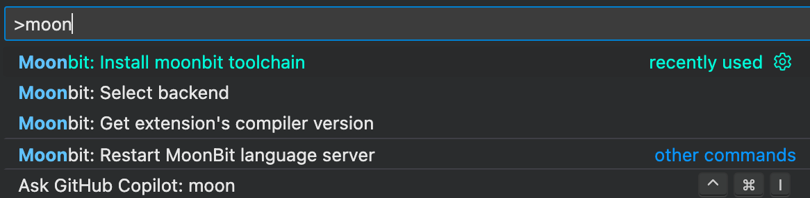

# A Tour of MoonBit for Beginners

This guide intended for newcomers, and it's not meant to be a 5-minute quick tour. This article tries to be a succinct yet easy to understand guide
for those who haven't programmed in a way that MoonBit enables them to do,
that is, in a more modern, functional way.

See [the General Introduction](./README.md) if you want to straight delve into the language.

## Installation

### the Extension

Currently, MoonBit development support are through VS Code extension. Navigate to
[VS Code Marketplace](https://marketplace.visualstudio.com/items?itemName=moonbit.moonbit-lang) to download MoonBit language support.

### the toolchain

> (Recommended) If you've installed the extension above, the runtime can be directly installed by running 'Install moonbit toolchain' in the action menu and you may skip this part:
> 

We also provide an installation script: Linux & macOS users can install via

```bash
curl -fsSL https://cli.moonbitlang.com/install/unix.sh | bash
```

For Windows users, powershell is used:

```powershell
Set-ExecutionPolicy RemoteSigned -Scope CurrentUser; irm https://cli.moonbitlang.com/install/powershell.ps1 | iex
```

This automatically installs MoonBit in `$HOME/.moon` and adds it to your `PATH`
Do notice that MoonBit is not production-ready at the moment, it's under active development. To update MoonBit, just run the commands above again.

Running `moon help` gives us a bunch of subcommands. But right now the only commands we need are `build` `run` and `new`.

To create a project (or module, more formally), run `moon new`. You will be greeted with a creation wizard, filling up all the info and we get

```
my-project
├── README.md
├── lib
│   ├── hello.mbt
│   ├── hello_test.mbt
│   └── moon.pkg.json
├── main
│   ├── main.mbt
│   └── moon.pkg.json
└── moon.mod.json
```

This resembles a typical MoonBit module structure. Try running `moon run main`.

Now, we can get started.

## Start Writing

In our tour, we will write all of the codes below in `main.mbt`. As you may have guessed, the `main` function within the `main` package is the main entrance of a program.
For a thorough introduction, please take a look at our [build system tutorial](https://www.moonbitlang.com/docs/build-system-tutorial).

### Variables

Variables are defined with `let`:

```moonbit
let e = 2.718281828459045 // double
let int_min = -2147483648 // int
let int_max: Int = 2147483647 // explicit type annotation
let tuple = (1, 2) // 2-tuple
```

```moonbit
fn init {
  let array = [1, 2, 3, 4, 5]
  // array = [4, 5, 6, 7, 8] // WRONG: let creates immutable bindings
  let mut mut_array = [1, 2, 3, 4, 5]
  mut_array = [4, 5, 6, 7, 8]
  println(mut_array)
}
```

MoonBit is a strictly typed language with type inference. In the example above, `let`
binds (we prefer the word _bind_ to assign) a symbol to a value. The symbol is inferred
to have the same type as the value. Hover over any of the symbols to check its type.

By default, the `let` - binding creates an immutable reference to a value. That is, you cannot change the symbol to reference something else without rebinding it (using `let`). Otherwise one should use `let mut`.

### Function

Function is just a piece of code that takes some inputs and produce a result. We may define a function using the keyword `fn` (function name in MoonBit should not begin with uppercase letters A-Z):

```moonbit
fn identity[T](x: T) -> T {
  // `Identity` won't work as it violates naming convention
  x
}
```

In this example, we provide types explicitly. Notice how it differs from traditional C-like languages
which uses prefix type notation `T x`, here we use postfix type notation `x: T` (Formally, we call it _type annotation_).

We write a arrow `->` before the return type to show the nature of a function: a map from some types to some other types. Formally, we call this syntax _trailing return type_ (languages such as C++, Rust, Swift, etc have this syntax as well).

> The word _expression_ is loosely used. Intuitively, An expression is something with a value we care about.

Consequently, a function type is denoted `(S) -> T` where `S` (within parenthesis) is the parameter type and `T` is the return type.
Functions in MoonBit are first-class, meaning it's always possible to pass functions around if you
get the type right:

```moonbit
fn compose[S, T, U](f : (T) -> U, g : (S) -> T) -> (S) -> U {
  let composition = fn(x : S) { f(g(x)) } // returns a composition of `f` and `g`

  // moonbit also provides the pipe `|>` operator,
  // similar to a lot of functional languages.
  fn(x : S) { g(x) |> f } // equivalent
}
```

Languages nowadays have something called _lambda expression_. Most language implement it as a mere syntactic sugar. A lambda expression is really just a anonymous closure, this, is resembled in our MoonBit's syntax:

> a closure only captures variables in its surroundings, together with its bound variable, that is, having the same indentation level.

```moonbit
fn foo() -> Int {
  fn inc(x) { x + 1 }  // named as `inc`
  fn (x) { x + inc(2) } (6) // anonymous, a so-called 'lambda expression'
  // function automatically captures the result of the last expression
}
```

```moonbit expr
foo() // => 9
```

Now we've learned the very basic, let's learn the rest by coding.

## Implementing List

### enum type

A linked list is a series of node whose right cell is a reference to its successor node. Sounds recursive? Because it is. Let's define it that way using MoonBit:

```moonbit live
enum List[T] {
  Nil // base case: empty list
  Cons(T, List[T]) // an recursive definition
}
```

The `enum` type works like any `enum` from traditional OO languages. However, let's refrain from using the OO-term `case`, we'll use _constructor_ from now on. We may read the above code as

> the type `List[T]` can be constructed from the constructor `Nil` or `Cons`, the former represents an empty list; the latter carries some data of type `T` and the rest of the list.

The square bracket used here is a _polymorphic_ (generic) definition, meaning a list of something of type `T`. Should we _instantiate_ `T` with a concrete type like `Int`, we define a list containing integers.

Another datatype frequently used in MoonBit is our good old `Struct`, which works like you would expect. Let's create a list of `User` using the definition above and `Struct`:

```moonbit
struct User {
  id: Int
  name: String
  // by default the properties/fields of a struct is immutable.
  // the `mut` keyword works exactly the way we've mentioned before.
  mut email: String
} derive(Debug)

// a method of User is defined by passing a object of type User as self first.
// just like what you would do in Python.
fn greetUser(self: User) -> String{ // a method of struct/type/class `User`
  let id = self.id
  let name = self.name
  "Greetings, \(name) of id \(id)" // string interpolation
}
// construct a User object.
let evan: User = {id:0,name:"Evan",email:"someone@example.com"}
// we use a shorthand by duplicating evan's information
// and replacing w/ someone elses' email.
let listOfUser: List[User] = Cons(evan, Cons({..evan, email: "someoneelse@example.com"}, Nil))
```

`enum`, `struct` and `newtype` are the 3 ways to define a datatype. There isn't `class` in MoonBit, nor does it need that.

the `derive` keyword is like Java's `extends` and `implements`. Here `Debug` is a _trait_,
indicates a type can be printed for debugging. So what is a trait?

### Trait

A trait (or type trait) is what we would call an `interface` in traditional OO-languages.
`debug(evan)` would print `{id: 0, name: "Evan", email: "someone@example.com"}`. As `User` consists
of builtin types `Int` `String`, we do not need to implement it explicitly. Let's implement the
trait `Printable` by implementing `to_string()`:

```moonbit
// actually we have `Show` that's builtin and does the same thing.
// but we'll use our own version of it -- `Printable`.
trait Printable {
  to_string(Self) -> String
}

fn to_string(self : User) -> String {
  (self.id,self.name,self.email).to_string()
} // now `Printable` is implemented

fn to_string[T: Printable](self : List[T]) -> String {
  let string_aux = to_string_aux(self)
  // function arguments can have label
  "[" + string_aux.substring(end = string_aux.length() - 1) + "]"
}

// polymorphic functions have to be toplevel.
fn to_string_aux[T: Printable](self: List[T]) -> String{
  match self {
    Nil => ""
    Cons(x,xs) => "\(x) " + to_string_aux(xs)
  }
}
```

```moonbit expr
listOfUser.to_string()
// => [(0, Evan, someone@example.com) (0, Evan, someoneelse@example.com)]
```

We use `<T extends Printable>` in Java to constrain the type of list element to make sure object of type
`T` can be printed, similarly, in MoonBit we would write `[T: Printable]`.

### Pattern Matching

In the example above we use the `match` expression, a core feature of MoonBit
(and many other functional programming languages.) In short, we use pattern matching
to _destructure_ (to strip the encapsulation of) a structure.

We may express the above `match` code as

> if `self` is constructed with `Nil` (an empty list), we return `""`,  
> otherwise if `self` is constructed with `Cons(x,xs)` (a non-empty list)
> we print `x` and rest of the list.
> Where `x` is the head of the `self` and `xs` being the rest.

Intuitively, we extract `x` and `xs` (they are bound in situ) from `self` using pattern matching. Let's implement typical list operations such as `map` `reduce` `zip`:

```moonbit
fn map[S, T](self : List[S], f : (S) -> T) -> List[T] {
  match self {
    Nil => Nil
    Cons(x, xs) => Cons(f(x), map(xs, f))
  }
}

fn reduce[S, T](self : List[S], op : (T, S) -> T, init : T) -> T {
  match self {
    Nil => init
    Cons(x, xs) => reduce(xs, op, op(init, x))
  }
}

fn zip[T](self : List[T], other : List[T]) -> List[T] {
  match (self, other) {
    (Nil, _) => Nil // we use underscore to ignore the value we don't care
    (_, Nil) => Nil
    (Cons(x, xs), Cons(y, ys)) => Cons(x, Cons(y, zip(xs, ys)))
  }
}
```

Now we have a somewhat usable `List` type. Realistically, we always prefer the builtin `Array`
which is much more efficient.

Pattern matching can be used in `let` as well. In `greetUser()`, instead of writing
2 `let`'s, we may write

```moonbit
fn greetUserAlt(self: User) -> String {
  // extract `id` `name` from `self` of type User. ignores email.
  let { id: id, name: name, email: _ } = self
  // equivalent, but ignores the rest.
  let {id,name,..} = self
  "Greetings, \(name) of id \(id)"
}
```

## Iteration

Finally, let's talk about the major point of every OO-language: looping. Although we've been using recursion all along, MoonBit is designed to be multi-paradigm, thus it retains C-style imperative `for` `while` loop.

Additionally, MoonBit provides a more interesting loop construct, the functional loop. For example the Fibonacci number can be calculated by

```moonbit
fn fib(n: Int) -> Int {
  loop n, 0, 1 { // introduces 3 loop variables: `n` `a = 0` `b = 1`
    // pattern matching is available in `loop`
    0, a, b => a // what can be constructed from 0 -- Only 0 it self!
    // assign `b` to `a`, `(a + b)` to `b`, decrease counter `n`
    n, a, b => continue n - 1, b, a + b

  }
}
```

```moonbit expr
[1, 2, 3, 4, 5, 6, 7, 8, 9, 10].map(fib) // => [1,1,2,3,5,8,13,21,34,55]
```

Semantic-wise, the `loop` construct focuses more on the transition of each state, providing
better readability, preserving recursive flavor and same performance without writing [tail-recursion](https://en.wikipedia.org/wiki/Tail_call) explicitly.

## Closing

At this point, we've learned about the very basic and most not-so-trivial features of MoonBit, yet MoonBit is a feature-rich, multi-paradigm programming language. After making sure that you are comfortable with the basics of MoonBit, we suggest that you look into some [interesting examples](https://www.moonbitlang.com/docs/category/examples) to get a better hold of MoonBit.
