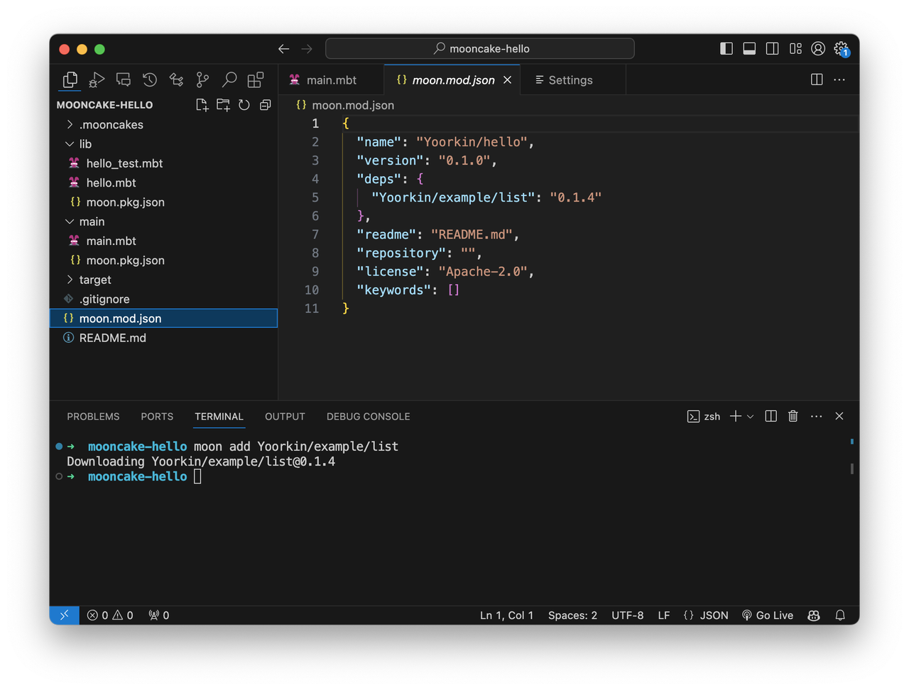

# MoonBit 包管理使用教程

MoonBit的构建系统无缝集成了包管理和文档生成工具，用户可以方便地从mooncakes.io获取依赖、查阅模块的文档，并推送新的模块。

[mooncakes.io](https://mooncakes.io/)是MoonBit的中心化包管理平台。所有的“月饼”都是一个模块，是最小的上传单位，都有一个对应的配置文件`moon.mod.json`。模块的路径下可以有多个包，每个包对应一个`moon.pkg.json`配置文件，与`moon.pkg.json`同一层级下的`.mbt`源码属于这个包。

在开始前，确保您已经安装了[moon](https://www.moonbitlang.cn/download/)。

## 注册和登录

**提示：如果不需要推送模块，可以跳过注册和登录的步骤。**

假如您还没有mooncakes.io的帐号，输入`moon register`，根据提示选择注册方式，完成注册后自动登录。如果之前注册过帐号，可以使用`moon login`登录。

当看到如下内容时，表示登录成功：

```
API token saved to ~/.moon/credentials.json
```

## 更新索引

使用`moon update`更新mooncakes.io索引。


## 创建工程

打开一个已有的工程，或者通过moon new创建一个新的工程：


## 添加模块依赖

浏览mooncakes.io的所有模块，可以通过`moon add`添加需要的依赖，或者手动编辑`moon.mod.json`中的`deps`字段。

例如添加`Yoorkin/example/list`这个模块的最新版本：



## 导入模块中的包

修改任意包的配置文件`moon.pkg.json`，在`import`字段声明这个包中需要导入的包。

例如下图修改了`hello/main/moon.pkg.json`：在`import`字段声明需要将`Yoorkin/example/list`导入到`main`包。此时在`main`包内即可通过`@list`调用第三方包的函数。


也可以给导入的包取一个别名：

```json
{
    "is_main": true,
    "import": [
        { "path": "Yoorkin/example/list", "alias": "ls" }
    ]
}
```

参考mooncakes.io上这个模块的文档，我们借助它提供的`of_array`和`reverse`函数反转并打印一个array。


## 移除依赖的模块

使用`moon remove <module name>`可以从`moon.mod.json`移除一项依赖。

## 上传新的模块

使用`moon publish`可以向mooncakes.io推送一个模块，上传的模块需要遵循语义化版本约定。

### 语义化版本

MoonBit包管理采用了[语义化版本](https://semver.org/lang/zh-CN/)。每个模块都必须定义一个版本号，格式为`主版本号.次版本号.修订号`。模块的每次更新推送都需要遵循兼容性规则来递增版本号：

- 主版本号：发生了不兼容的 API 修改，
- 次版本号：发生了向下兼容的功能性新增，
- 修订号：发生了向下兼容的问题修正。

moon实现了[最小版本选择](https://research.swtch.com/vgo-mvs)，将会根据模块的语义化版本信息自动处理并安装依赖。最小版本选择假设每个模块都声明了自己的依赖需求，并遵循兼容性规则。使用户构建的依赖关系尽可能接近作者开发时的依赖关系。


### README与元信息

moon默认创建的`README.md`以及`moon.mod.json`中的元信息会被展示在mooncakes.io上的模块页面中。

目前`moon.mod.json`支持的元信息包括：

- `license`: 模块的采用的开源协议，字段的格式采用[SPDX](https://spdx.dev/about/overview/)表达式
- `keywords`: 模块的关键字
- `repository`: 模块的仓库地址
- `description`: 关于模块的简短说明
- `homepage`: 项目的网站地址

### Moondoc

mooncakes.io集成了moondoc文档生成器，所有模块的文档会被自动构建。文档内的信息来自模块导出的`fn`、`enum`、`let`、`trait`等顶层成员以及它们的文档注释。

在每个顶层成员之前可以添加多行以`///`开头的文档注释。文档注释使用markdown的语法格式：

```moonbit
/// Get the largest element of a non-empty `Array`.
/// 
/// # Example
/// 
/// ```
/// maximum([1,2,3,4,5,6]) = 6
/// ```
///
/// # Panics
///
/// Panics if the `xs` is empty.
///
pub fn maximum[T : Compare](xs : Array[T]) -> T {
    //TODO ...
}
```

此外，使用`moon doc --serve`可以在本地生成并预览模块的文档。
