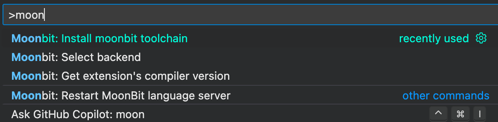

# MoonBit 新手之旅

这一文档针对不熟悉语言的新手用户所写，并不打算作为一个几分钟就能读完的小文章。
本文希望为那些对 MoonBit 的编程思路 (更加现代化，函数式的) 不甚了解的用户提供一个简洁而不失易懂性的指南。

对于那些希望能直接接触语言的用户，请移步[语法参考](./README.md)

本文译自对应的英文文档 _A Tour of MoonBit for Beginners_

## 安装

### 语言插件

目前 MoonBit 提供的开发支持都是通过 VS Code 插件实现的。转到 [VS Code Marketplace](https://marketplace.visualstudio.com/items?itemName=moonbit.moonbit-lang) 来下载 MoonBit 语言支持。

### 工具链

> （推荐方式）若您已安装了上述插件，可以通过 action menu 中的 'Install moonbit toolchain' 下载工具链并跳过这部分介绍。
> 

除去插件支持外，我们还提供一键安装脚本：Linux 和 macOS 用户可以通过以下命令安装

```bash
curl -fsSL https://cli.moonbitlang.cn/install/unix.sh | bash
```

Windows 用户可以通过 PowerShell 安装：

```powershell
Set-ExecutionPolicy RemoteSigned -Scope CurrentUser; irm https://cli.moonbitlang.cn/install/powershell.ps1 | iex
```

安装脚本会将工具链安装到 `$HOME/.moon` 下，并自己添加到 `PATH` 环境变量里。

MoonBit 目前处于活跃开发的阶段，尚不满足生产环境的需求。若需要更新，只需再次运行上述命令即可。

可以通过 `moon new` 交互式地创建新项目（模块），填写好必要信息之后将会在项目路径下生成如下结构

```
my-project
├── README.md
├── lib
│   ├── hello.mbt
│   ├── hello_test.mbt
│   └── moon.pkg.json
├── main
│   ├── main.mbt
│   └── moon.pkg.json
└── moon.mod.json
```

这是一个很典型的项目结构，试试运行 `moon run main`。

现在可以开始我们的月兔之旅了。

## 开始编码

本文中我们会把以下所有的代码都写在 `main.mbt` 中。`main` 函数是程序的入口点，并且只能出现在 `main` 包中。
更细致的介绍可以在我们的《[MoonBit 构建系统配置](https://www.moonbitlang.cn/docs/build-system-configuration)》一文中找到。

### 变量

变量通过 `let` 来定义：

```moonbit
let e = 2.718281828459045 // double
let int_min = -2147483648 // int
let int_max: Int = 2147483647 // 显式类型标注
let tuple = (1, 2) // 2-tuple
```

```moonbit
fn init {
  let array = [1, 2, 3, 4, 5]
  // array = [4, 5, 6, 7, 8] // 错误：`let` 创建的是不可变绑定。
  let mut mut_array = [1, 2, 3, 4, 5]
  mut_array = [4, 5, 6, 7, 8]
  println(mut_array)
}
```

MoonBit 是一个带类型推断的严格类型语言。在上方的例子中，`let` 绑定（我们习惯说绑定而不是赋值）一个符号到一个值上，
这个符号也就被推断为拥有和值一致的类型。试试将光标悬浮到代码块的任何符号上来查看其类型。

默认情况下 `let` 绑定创建的是一个不可变的引用（这里的引用指的不是 C++ 或 Rust 的引用，只是一种符号和值的联系）。
也就是说不能让某个符号去引用别的值，除非重新绑定它（使用 `let`），否则应当使用 `let mut`。

### 函数

函数不过是一段接受某些输入并产生一个输出的一段代码。我们用关键词 `fn` 来定义一个函数（MoonBit 中的函数不应该由大写字母 A-Z 起头）：

```moonbit
fn identity[T](x: T) -> T { // `Identity` 则不符合命名规范
  x
}
```

在这个例子中，我们显式地给定了类型。注意类型标注写法上和传统类 C 语言的差别：
后者使用前缀类型标注 `T x`，我们则用后缀类型标注 `x: T`。

我们在返回类型前用箭头 `->` 来表示一个函数的本质：从某个类型到某个类型的映射。
正式地说，这一写法叫做尾随类型标注（trailing return type），诸如 C++、Rust、Swift 等语言都有相同的写法。

> 表达式一词在本文的介绍中没有严格定义，直观上可理解为某样具有我们关心的值的东西。

因此， 一个函数类型可以写作 `(S) -> T`，其中 `S`（用圆括号括起）是参数类型，而 `T` 是返回类型。
MoonBit 中的函数是头等公民，即函数可以像普通的变量一样传来传去，只要保证类型正确即可。

```moonbit
fn compose[S, T, U](f : (T) -> U, g : (S) -> T) -> (S) -> U {
  let composition = fn(x : S) { f(g(x)) } // 定义一个 `f` `g` 的复合函数

  // 和其他函数式语言相似
  // moonbit 还提供管道（pipe）操作符 `|>`
  fn(x : S) { g(x) |> f } // 等价写法
}
```

现在的语言一般都有 Lambda 表达式。大部分语言是通过语法糖来实现这一特性的。
一个 Lambda 表达式不过是一个匿名的闭包，这一特性也体现在 MoonBit 的语法上：

> 闭包只捕捉其周围（即同一缩进等级的，假设代码已经格式化过）的变量和自己的约束变量

```moonbit
fn foo() -> Int {
  fn inc(x) { x + 1 }  // 命名为 `inc`
  fn (x) { x + inc(2) } (6) // 匿名函数，即 lambda 表达式
  // 函数会自动捕捉最后一个表达式的值并返回
}
```

```moonbit expr
foo() // => 9
```

现在我们学习了最基本的知识，接下来写点代码吧。

## 实现链表

链表由一系列指向自己之后的结点的结点构成。听起来很递归？实际上也的确如此，我们就用递归的方式实现它：

```moonbit
enum List[T] {
  Nil // 基本情况：空表
  Cons(T, List[T]) // 递归定义
}
```

`enum` 即枚举类，和传统面向对象语言中的相同。不过我们尽量不用面向对象的叫法（分支，cases），而称其为构造子。
因而上述代码可以读作

> 类型 `List[T]` 可以由 `Nil` `Cons` 构造子构造而来，前者表示一个空链表，后者能够容纳一些类型为 `T` 的数据和链表的剩余部分。
这里的方括号告诉我们这是一个多态/泛型（polymorphic/generic）函数，即一个元素类型为 `T` 的链表（此处 `T` 可以是任何类型，因此称多态）。
如果用 `Int` 实例化这个 `T`，我们就定义了一个整数的链表。

另外一个常见的数据类型是我们的老熟人 `Struct`，其工作方式和类 C 语言中的同名结构相似。我们用上面定义的 `List`
和下方将要定义的 `User` 来创建一个用户列表：

```moonbit
struct User {
  id: Int
  name: String
  // 默认情况下 Struct 的属性/字段是不可变的
  // `mut` 关键字就和我们之前说的一样
  mut email: String
} derive(Show)

// 我们通过把函数第一个参数定义为 `self: User` 来给该 Struct 定义一个 method
// 写法和 Python 类似
// 注意：只有类型所在的包能为其定义方法。 不能直接为外部类型定义方法。
fn greetUser(self: User) -> String{ // `User` 的一个方法
  let id = self.id
  let name = self.name
  "Greetings, \(name) of id \(id)" // 字符串插值写法
}

// 构造 User 对象的写法
let evan: User = {id:0,name:"Evan",email:"someone@example.com"}
// 可以用一个语法糖将 evan 的属性复制一遍，
// 并把其 email 换成其他的值，构造一个新对象
let listOfUser: List[User] = Cons(evan, Cons({..evan, email: "someoneelse@example.com"}, Nil))
```

除了这两种数据类型之外，还有一种较为特殊的枚举类型：`type`. 可以看作其将已存在的类型包装起来，
成为一个新的类型。这样能在保持原有类型特性的基础上继续新增方法，达到为外部类型定义方法的功能。
例如 `User` 中的 `name` 的类型，我们还可以定义为

```moonbit no-check
type UserName String // 一个新类型 UserName，基于 String

// 可以为 UserName 定义方法，String 则不行。
fn is_blank(self : UserName) -> Bool {
  // 通过 `.0` 访问其内部类型（String）
  for index = 0; index < self.0.length(); index = index + 1 {
    if self.0[index] != ' ' {
      return false
    }
  } else { // for-else
    return true
  }
}
```

`enum` `struct` `newtype` 是定义数据类型的三种方式，MoonBit 中没有 `class`，且也不需要。

`derive` 关键字就和 Java 的 `implements` 相似。这里 `Show` 是一个类型类（type trait/class），
它指出一个类型的内容可以被打印出来。那么什么是类型类？

### 类型类

类型类（trait）就是我们在传统面向对象编程中熟悉的接口（interface）。
`println(evan)` 会输出 `{id: 0, name: "Evan", email: "someone@example.com"}`，
这是因为 `User` 由内置类型 `Int` `String` 组成，后者已经实现该 trait，
所以我们不需要手动实现。
不妨通过实现 `to_string()` 来实现我们自己定义的 `Printable` trait：

```moonbit
trait Printable {
  to_string(Self) -> String
}

fn to_string(self : User) -> String {
  (self.id,self.name,self.email).to_string()
} // 这样就实现了 `Printable`

fn to_string[T: Printable](self : List[T]) -> String {
  let string_aux = to_string_aux(self)
  // 函数参数可以有标签
  "[" + string_aux.substring(end = string_aux.length() - 1) + "]"
}

// 多态函数一定是顶层函数
fn to_string_aux[T: Printable](self: List[T]) -> String{
  match self {
    Nil => ""
    Cons(x,xs) => "\(x) " + to_string_aux(xs)
  }
}
```

```moonbit expr
listOfUser.to_string()
// => [(0, Evan, someone@example.com) (0, Evan, someoneelse@example.com)]
```

在 Java 中我们一般使用 `<T extends Printable>` 来限制某个泛型函数的参数类型，
使得类型 `T` 的对象都能够输出。
与之相仿，在 MoonBit 中我们一般写成 `[T: Printable]`。

### 模式匹配

在上面的例子中我们使用了 `match` 表达式，这是 MoonBit（和许多函数式语言的）的核心特性之一。
简单地说，我们使用模式匹配（pattern matching）来解构（destructure, 即脱去外层的包装/抽象）一个结构。

上方的 `match` 代码可以表述为

> 如果 `self` 是通过 `Nil` 构造子（空链表）构造的，我们返回 `""`；
> 否则如果 `self` 是通过 `Cons(x,xs)` 构造出来的（非空链表）
> 我们输出 `x` 和链表的剩余部分，其中 `x` 是链表的头， `xs` 是剩余部分。

直观上，我们是把 `x` 和 `xs` （这两个符号也是原地绑定的）从 `self` 中通过模式匹配提取出来。
不妨借此定义一些典型的链表操作 `map` `reduce` `zip`：

```moonbit
fn map[S, T](self : List[S], f : (S) -> T) -> List[T] {
  match self {
    Nil => Nil
    Cons(x, xs) => Cons(f(x), map(xs, f))
  }
}

fn reduce[S, T](self : List[S], op : (T, S) -> T, init : T) -> T {
  match self {
    Nil => init
    Cons(x, xs) => reduce(xs, op, op(init, x))
  }
}

fn zip[T](self : List[T], other : List[T]) -> List[T] {
  match (self, other) {
    (Nil, _) => Nil // 我们用下划线表示我们不关心的值
    (_, Nil) => Nil
    (Cons(x, xs), Cons(y, ys)) => Cons(x, Cons(y, zip(xs, ys)))
  }
}
```

现在我们总算是拥有一个勉强可用的链表类型了。
实际上，绝大多数时候我们都用内置的 `Array` 类型，
因为其性能要好得多。

模式匹配也能够在 `let` 中使用。在 `greetUser()` 中，可以把两个 `let` 绑定改写为

```moonbit
fn greetUserAlt(self: User) -> String {
  // 从 `self` 中提取 `id` `name` 字段，忽略 `email`
  let { id: id, name: name, email: _ } = self
  // 等价写法，但是忽略 `id `name` 之外的所有字段。
  let {id,name,..} = self
  "Greetings, \(name) of id \(id)"
}
```

## 循环

最后来了解一下面向对象语言中十分重要的循环结构。虽然我们上面主要使用递归，
MoonBit 本身是一个多范式语言，
因而其也保留了 C 风格命令式的的 `for` `while` 循环结构。

除此之外，MoonBit 还提供了一种更有意思的写法：函数式循环。譬如斐波那契数就可以写成

```moonbit
fn fib(n: Int) -> Int {
  loop n, 0, 1 { // 引入 3 个循环变量: `n` `a = 0` `b = 1`
    // `loop` 中也可以使用 pattern matching
    0, a, _ => a // 只有 0 能从 0 构造出来。
    // 将 `b` 赋给 `a`，`(a + b)` 赋给 `b`，循环计数器 `n - 1`
    n, a, b => continue n - 1, b, a + b
  }
}
```

```moonbit expr
[1, 2, 3, 4, 5, 6, 7, 8, 9, 10].map(fib) // => [1,1,2,3,5,8,13,21,34,55]
```

从语义上讲， 函数式循环更强调迭代过程中每个状态的转换，
相比 [tail-recursive](https://en.wikipedia.org/wiki/Tail_call) 的写法，
前者的可读性更佳，也保留了递归的风格，同时还具备和尾递归相同的性能。

## 结束语

到目前为止，我们已学习了 MoonBit 的基本语法和一些较为重要的特性，但 MoonBit 本身是一个具有众多特性，
多范式的编程语言。我们建议您在确定 MoonBit 的基本语法合口味之后，
读一读一些[有意思的样例](https://www.moonbitlang.cn/docs/category/examples)，
来加深您的理解。
